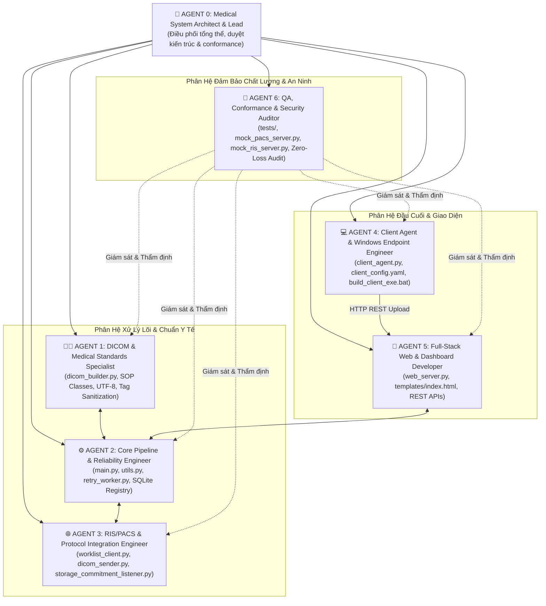

# ĐỘI NGŨ AGENT PHÁT TRIỂN & VẬN HÀNH HỆ THỐNG DICOM GATEWAY SERVICE

Tài liệu này định nghĩa cấu trúc tổ chức, vai trò, nhiệm vụ chuyên biệt, ma trận phân quyền file và **hệ thống rào cản nghiêm ngặt (Guardrails & Constraints)** cho đội ngũ Agent AI tham gia phát triển, bảo trì và mở rộng hệ thống **DICOM Gateway Service**.

---

## 🏛️ 1. SƠ ĐỒ TỔ CHỨC ĐỘI NGŨ AGENT (AGENT TEAM STRUCTURE)



---

## 👥 2. CHI TIẾT TỪNG AGENT: NHIỆM VỤ & PHẠM VI TRÁCH NHIỆM

---

### 👨‍⚕️ AGENT 1: DICOM & Medical Standards Specialist (Chuyên Gia Chuẩn Y Tế & DICOM)
* **Mục tiêu**: Đảm bảo tất cả file ảnh/tài liệu được chuyển đổi đúng chuẩn quốc tế DICOM PS3.x, tương thích 100% với các máy chủ PACS và các phần mềm PACS Viewer y tế.
* **Tập tin phụ trách chính**:
  * [`dicom_builder.py`](file:///e:/Work/Apps/TTSG_Dicom_Gateway/dicom_builder.py)
* **Nhiệm vụ cốt lõi**:
  1. Xây dựng và tối ưu thuật toán đóng gói `Secondary Capture Image Storage` (`1.2.840.10008.5.1.4.1.1.7`) và `Encapsulated PDF Storage` (`1.2.840.10008.5.1.4.1.1.104.1`).
  2. Bổ sung và duy trì hỗ trợ các SOP Class chuyên biệt: `Ultrasound Image Storage`, `CR Image Storage`, `Digital X-Ray Image Storage`.
  3. Chuẩn hóa bộ ký tự quốc tế UTF-8 (`SpecificCharacterSet = 'ISO_IR 192'`).
  4. Thuật toán làm sạch và chuẩn hóa Metadata: Xóa ký tự phân cách `^`, `_` trong `PatientName`, chuẩn hóa định dạng ngày `YYYYMMDD` (`PatientBirthDate`, `StudyDate`) và giờ `HHMMSS` (`StudyTime`).
  5. Sinh mã UID định danh đơn nhất (`generate_uid`) và Deterministic UID theo Study/Series (`generate_deterministic_uid`).
  6. Duy trì quy chuẩn cấu trúc thẻ phân định File Report chính (`InstanceNumber=1`, `DocumentTitle='PHIẾU KẾT QUẢ CẬN LÂM SÀNG'`) vs File phụ đính kèm (`InstanceNumber=2,3..`).

---

### ⚙️ AGENT 2: Core Pipeline & Reliability Engineer (Kỹ Sư Lõi Pipeline & Ổn Định Dữ Liệu)
* **Mục tiêu**: Đảm bảo tiến trình Gateway Server vận hành 24/7 bền bỉ, an toàn dữ liệu, chống trùng lặp và tự động thử lại khi có sự cố.
* **Tập tin phụ trách chính**:
  * [`main.py`](file:///e:/Work/Apps/TTSG_Dicom_Gateway/main.py)
  * [`utils.py`](file:///e:/Work/Apps/TTSG_Dicom_Gateway/utils.py)
  * [`retry_worker.py`](file:///e:/Work/Apps/TTSG_Dicom_Gateway/retry_worker.py)
  * `data/registry.sqlite3`
* **Nhiệm vụ cốt lõi**:
  1. Quản lý luồng xử lý nền `GatewayWorker` và theo dõi thư mục bằng `watchdog` (`InboxHandler`, `Observer`).
  2. Kiểm tra độ ổn định ghi file (`wait_for_stable_file`) tránh đọc file đang ghi dở từ thiết bị y tế.
  3. Duy trì hệ thống băm SHA-256 (`compute_file_hash`) và CSDL `ProcessedRegistry` SQLite để chống gửi trùng lặp (`duplicates_folder`).
  4. Quản lý hàng đợi tự động thử lại (`RetryWorker`) với thuật toán **Exponential Backoff** và file sidecar `.json`.
  5. Quản lý cấu hình `config.yaml` (`load_config`, `save_config`, `_validate_config`).
  6. Hệ thống xoay vòng log hàng ngày (`TimedRotatingFileHandler`) và quản lý tắt service an toàn (Graceful Shutdown).

---

### 🌐 AGENT 3: RIS/PACS & Network Protocol Engineer (Kỹ Sư Tích Hợp RIS/PACS & Mạng Y Tế)
* **Mục tiêu**: Làm chủ các giao thức truyền thông mạng y tế DICOM DIMSE (`C-STORE`, `C-FIND`, `C-ECHO`) và `Storage Commitment` (`N-ACTION`, `N-EVENT-REPORT`).
* **Tập tin phụ trách chính**:
  * [`dicom_sender.py`](file:///e:/Work/Apps/TTSG_Dicom_Gateway/dicom_sender.py)
  * [`worklist_client.py`](file:///e:/Work/Apps/TTSG_Dicom_Gateway/worklist_client.py)
  * [`storage_commitment_listener.py`](file:///e:/Work/Apps/TTSG_Dicom_Gateway/storage_commitment_listener.py)
  * [`inspect_pacs_query.py`](file:///e:/Work/Apps/TTSG_Dicom_Gateway/inspect_pacs_query.py)
  * [`inspect_worklist_raw.py`](file:///e:/Work/Apps/TTSG_Dicom_Gateway/inspect_worklist_raw.py)
* **Nhiệm vụ cốt lõi**:
  1. Quản lý kết nối SCU/SCP với PACS Server: Đàm phán Presentation Context, gửi file DICOM qua `C-STORE`, kiểm tra kết nối `C-ECHO`.
  2. Tích hợp tính năng `Storage Commitment Push Model` (gửi `N-ACTION` và lắng nghe `N-EVENT-REPORT` trên Port `105`).
  3. Quản lý client truy vấn `RIS Modality Worklist` qua `C-FIND`: Tra cứu bệnh nhân theo `PatientID` để tự động bổ sung metadata (PatientName, DOB, Sex, AccessionNumber, StudyInstanceUID).
  4. Phát triển và duy trì các công cụ chẩn đoán chuyên sâu (`inspect_pacs_query.py`, `inspect_worklist_raw.py`).
  5. Đảm bảo cấu hình Card mạng kép (**Dual-NIC Isolation**) hoạt động thông suốt, không bị đụng độ định tuyến (Routing Collision).

---

### 💻 AGENT 4: Client Agent & Windows Endpoint Engineer (Kỹ Sư Ứng Dụng Máy Trạm Client)
* **Mục tiêu**: Phát triển và tối ưu ứng dụng Client Agent chạy trên các máy trạm thiết bị y tế (VLAN `10.4.140.x`), đảm bảo siêu nhẹ, độc lập và chống mất dữ liệu khi mất kết nối mạng.
* **Tập tin phụ trách chính**:
  * [`client_agent.py`](file:///e:/Work/Apps/TTSG_Dicom_Gateway/client_agent.py)
  * [`client_config.yaml`](file:///e:/Work/Apps/TTSG_Dicom_Gateway/client_config.yaml)
  * [`build_client_exe.bat`](file:///e:/Work/Apps/TTSG_Dicom_Gateway/build_client_exe.bat)
  * [`Client/`](file:///e:/Work/Apps/TTSG_Dicom_Gateway/Client)
* **Nhiệm vụ cốt lõi**:
  1. Duy trì tiến trình nền theo dõi thư mục xuất ảnh của máy khám (`watch_folder`).
  2. Kiểm tra độ ổn định file tại local (`is_file_stable`).
  3. Gửi file tự động qua HTTP REST API (`POST /api/upload-manual`) về Gateway Server trung tâm.
  4. Xây dựng và bảo toàn cơ chế **Offline Buffer**: Lưu trữ file local (`sent_folder`, `failed_folder`) và tự động gửi bù khi mạng online trở lại.
  5. Đóng gói ứng dụng thành file thực thi độc lập **`client_agent.exe`** bằng PyInstaller, **tuyệt đối không yêu cầu cài đặt Python hay thư viện ngoài trên máy trạm**.
  6. Hỗ trợ cơ chế tự khởi động cùng Windows (`shell:startup` / Windows Service).

---

### 🎨 AGENT 5: Full-Stack Web & Dashboard Developer (Lập Trình Viên Web Control Panel & API)
* **Mục tiêu**: Xây dựng và duy trì giao diện Web Dashboard quản trị nguyên khối, trực quan, thân thiện cho Bác Sĩ / Kỹ thuật viên và cung cấp REST API cho toàn hệ thống.
* **Tập tin phụ trách chính**:
  * [`web_server.py`](file:///e:/Work/Apps/TTSG_Dicom_Gateway/web_server.py)
  * [`templates/index.html`](file:///e:/Work/Apps/TTSG_Dicom_Gateway/templates/index.html)
* **Nhiệm vụ cốt lõi**:
  1. Phát triển Flask REST API phục vụ: Lấy trạng thái hệ thống (`/api/status`), xem/cập nhật cấu hình (`/api/config`), test C-ECHO PACS/RIS (`/api/test-pacs`, `/api/test-ris`), truy vấn Worklist (`/api/worklist`), xem lịch sử (`/api/studies`), tải lên thủ công/batch (`/api/upload-manual`), đọc log realtime (`/api/logs`), kích hoạt retry tức thời (`/api/retry-now`).
  2. Duy trì giao diện Web Dashboard 4 Tab:
     * **Tab 1**: Tổng quan chỉ số, trạng thái kết nối, log terminal trực tiếp.
     * **Tab 2**: RIS Worklist với thanh lọc gọn 1 dòng (Single-line Compact Filter Bar), nút tác vụ nhanh `🩺 Thực hiện CLS`.
     * **Tab 3**: Form nhập ca khám, kéo thả batch nhiều file ảnh/PDF, giao diện chọn **`⭐ [Report chính]`** (viền xanh nổi bật), menu dịch vụ mẫu.
     * **Tab 4**: Lịch sử ca khám SQLite, test C-ECHO, chỉnh sửa cấu hình YAML trực tiếp.
  3. Đảm bảo giao diện phản hồi nhanh, không lag, chuẩn UX y tế, không dùng framework cồng kềnh ngoài Vanilla JS/CSS.

---

### 🧪 AGENT 6: QA, Conformance & Security Auditor (Kiểm Thử, Chuẩn Hóa & An Ninh Y Tế)
* **Mục tiêu**: Đảm bảo chất lượng toàn diện, kiểm thử tự động, xác minh chuẩn DICOM Conformance, tuân thủ an ninh mạng y tế và rà soát các rủi ro mất mát dữ liệu.
* **Tập tin phụ trách chính**:
  * [`tests/`](file:///e:/Work/Apps/TTSG_Dicom_Gateway/tests) (`test_dicom_builder.py`, `test_utils.py`, `test_web_server.py`, `test_client_agent.py`)
  * [`mock_pacs_server.py`](file:///e:/Work/Apps/TTSG_Dicom_Gateway/mock_pacs_server.py)
  * [`mock_ris_server.py`](file:///e:/Work/Apps/TTSG_Dicom_Gateway/mock_ris_server.py)
  * [`test_pacs_connection.py`](file:///e:/Work/Apps/TTSG_Dicom_Gateway/test_pacs_connection.py)
* **Nhiệm vụ cốt lõi**:
  1. Xây dựng và thực thi các bộ Unit Tests, Integration Tests cho toàn bộ pipeline.
  2. Duy trì và cải tiến các Mock Server (`mock_pacs_server.py`, `mock_ris_server.py`) để kiểm thử độc lập mà không cần môi trường PACS/RIS thật.
  3. Thẩm định tính toàn vẹn của file DICOM tạo ra (kiểm tra đầy đủ các thẻ Mandatory DICOM Type 1 & Type 2).
  4. Đánh giá tính an toàn bảo mật: Đảm bảo không có rò rỉ dữ liệu bệnh nhân (PHI/HIPAA compliance), không có lỗ hổng Command Injection / Path Traversal trong API Upload.
  5. Thử nghiệm các kịch bản sự cố (Chaos Testing): Mất mạng đột ngột, PACS downtime, file lỗi định dạng, file dung lượng lớn, tên file chứa ký tự đặc biệt.

---

## 🛑 3. HỆ THỐNG RÀO CẢN NGHIÊM NGẶT CHO CÁC AGENT (STRICT GUARDRAILS & BOUNDARIES)

Để đảm bảo an toàn tuyệt đối cho hệ thống y tế hoạt động thực tế tại bệnh viện, tất cả các Agent bắt buộc phải tuân thủ các **RÀO CẢN BẤT KHẢ XÂM PHẠM** sau:

```
┌───────────────────────────────────────────────────────────────────────────────────┐
│                           🚨 HỆ THỐNG 5 RÀO CẢN CỐT LÕI                           │
├───────────────────────────────────────────────────────────────────────────────────┤
│ 1. 🛡️ RÀO CẢN BẢO TOÀN DỮ LIỆU (ZERO DATA LOSS & NON-DESTRUCTIVE)                 │
│ 2. 🏥 RÀO CẢN CHUẨN MỰC Y TẾ (DICOM & PATIENT PRIVACY CONFORMANCE)               │
│ 3. 🌐 RÀO CẢN AN NINH MẠNG KÉP (AIR-GAP & DUAL-NIC ISOLATION)                     │
│ 4. 🪶 RÀO CẢN ĐẦU CUỐI CLIENT (ZERO-DEPENDENCY & LIGHTWEIGHT ENDPOINT)            │
│ 5. ⚡ RÀO CẢN TIẾN TRÌNH & ĐỒNG THỜI (THREAD-SAFETY & NON-BLOCKING PIPELINE)      │
└───────────────────────────────────────────────────────────────────────────────────┘
```

### 🛡️ Rào Cản 1: Bảo Toàn Dữ Liệu Y Tế (Zero Data Loss & Non-Destructive Guardrail)
* **Áp dụng cho**: Tất cả Agent, đặc biệt là `Agent 2 (Core)`, `Agent 4 (Client)`, `Agent 5 (Web)`.
* **Quy tắc cấm (Forbidden)**:
  * ❌ **TUYỆT ĐỐI CẤM** xóa file gốc của thiết bị y tế khi chưa xác nhận đã backup thành công sang thư mục an toàn (`processed` hoặc `failed`).
  * ❌ **TUYỆT ĐỐI CẤM** hủy bỏ (drop) các ca gửi PACS thất bại mà không đưa vào hàng đợi `retry` kèm file sidecar `.json`.
  * ❌ **TUYỆT ĐỐI CẤM** ghi đè đè file (overwrite) trùng tên mà không qua hàm chống trùng `dedupe_destination` (tự động đổi tên thành `_1`, `_2`).
  * ❌ **TUYỆT ĐỐI CẤM** xử lý file ngay lập tức khi file vừa xuất hiện mà không chạy qua `wait_for_stable_file` (tránh đọc dữ liệu dở dang khi thiết bị đang ghi).

---

### 🏥 Rào Cản 2: Chuẩn Mực Y Tế & Metadata (DICOM & Privacy Conformance Guardrail)
* **Áp dụng cho**: `Agent 1 (DICOM)`, `Agent 3 (RIS/PACS)`, `Agent 5 (Web)`.
* **Quy tắc cấm (Forbidden)**:
  * ❌ **TUYỆT ĐỐI CẤM** tạo file DICOM thiếu các thẻ định danh bắt buộc: `SOPClassUID`, `SOPInstanceUID`, `StudyInstanceUID`, `SeriesInstanceUID`, `PatientID`.
  * ❌ **TUYỆT ĐỐI CẤM** làm gián đoạn hoặc dừng pipeline xử lý chỉ vì thiếu thông tin phụ (Patient Name, DOB, Sex). Nếu thiếu, phải dùng giá trị mặc định (`UNKNOWN` / ngày hiện tại) và ghi log cảnh báo, không được văng Exception làm sập tiến trình.
  * ❌ **TUYỆT ĐỐI CẤM** để sót ký tự phân cách `^` hoặc `_` trong thẻ `PatientName` khi xuất DICOM.
  * ❌ **TUYỆT ĐỐI CẤM** gán sai `InstanceNumber`: Phiếu kết quả chính bắt buộc phải có `InstanceNumber = 1` (để PACS hiển thị trên đầu), các tài liệu phụ là `InstanceNumber = 2, 3..`.
  * ❌ **TUYỆT ĐỐI CẤM** sử dụng bảng mã khác ngoài `ISO_IR 192` (UTF-8 chuẩn quốc tế).

---

### 🌐 Rào Cản 3: An Ninh Mạng Kép (Air-Gap & Dual-NIC Isolation Guardrail)
* **Áp dụng cho**: `Agent 3 (RIS/PACS)`, `Agent 4 (Client)`, `Agent 5 (Web)`.
* **Quy tắc cấm (Forbidden)**:
  * ❌ **TUYỆT ĐỐI CẤM** cấu hình cho phép các máy trạm phòng khám (`10.4.140.x`) kết nối trực tiếp vào mạng nội bộ PACS/RIS (`192.168.6.x`). Mọi luồng giao tiếp bắt buộc phải đi qua API kiểm duyệt của Gateway Server (`192.168.0.3`).
  * ❌ **TUYỆT ĐỐI CẤM** điền `Default Gateway` trên Card mạng 2 (NIC 2 - PACS/RIS) để tránh gây xung đột định tuyến hệ thống mạng của Server.
  * ❌ **TUYỆT ĐỐI CẤM** truyền gửi dữ liệu hình ảnh hoặc thông tin bệnh nhân ra các dịch vụ Cloud bên ngoài (Tuân thủ bảo mật dữ liệu y tế nội bộ).

---

### 🪶 Rào Cản 4: Đầu Cuối Máy Trạm Siêu Nhẹ (Zero-Dependency Client Guardrail)
* **Áp dụng cho**: `Agent 4 (Client Agent)`.
* **Quy tắc cấm (Forbidden)**:
  * ❌ **TUYỆT ĐỐI CẤM** tích hợp các thư viện DICOM nặng (`pydicom`, `pynetdicom`, `numpy`, `C-extensions`) vào Client Agent trên máy trạm phòng khám. Client Agent chỉ được phép xử lý đọc file và gửi HTTP POST.
  * ❌ **TUYỆT ĐỐI CẤM** yêu cầu máy trạm y tế phải cài đặt Python hoặc cấu hình môi trường phức tạp. Bản phân phối máy trạm **bắt buộc là file thực thi độc lập duy nhất (`client_agent.exe`)**.
  * ❌ **TUYỆT ĐỐI CẤM** để Client Agent bị crash hoặc dừng hoạt động khi mất kết nối tới Gateway Server. Khi mất mạng, Client Agent phải âm thầm giữ file tại hàng đợi local buffer và thử lại định kỳ.

---

### ⚡ Rào Cản 5: An Toàn Đa Luồng & Bất Đồng Bộ (Thread-Safety & Non-Blocking Pipeline)
* **Áp dụng cho**: `Agent 2 (Core)`, `Agent 3 (RIS/PACS)`, `Agent 5 (Web)`.
* **Quy tắc cấm (Forbidden)**:
  * ❌ **TUYỆT ĐỐI CẤM** thực hiện các thao tác I/O mạng kéo dài (như chờ C-STORE, kết nối RIS timeout) trực tiếp trên luồng chính (Main Thread) hoặc luồng xử lý Web Request làm treo giao diện Web.
  * ❌ **TUYỆT ĐỐI CẤM** truy cập CSDL SQLite `registry.sqlite3` từ nhiều luồng mà không thông qua cơ chế khóa đồng bộ `threading.Lock()` trong class `ProcessedRegistry`.
  * ❌ **TUYỆT ĐỐI CẤM** để lỗi phát sinh từ bước phụ `Storage Commitment` (`N-ACTION`) làm đảo ngược kết quả C-STORE đã thành công trước đó.

---

## 📊 4. MA TRẬN PHÂN QUYỀN FILE & TRÁCH NHIỆM (CODE OWNERSHIP MATRIX)

Ký hiệu:
* **`R/W (Primary)`**: Toàn quyền sửa đổi chính, chịu trách nhiệm kiến trúc file.
* **`R (Read-Only)`**: Chỉ được đọc để tích hợp, không tự ý sửa đổi khi chưa có sự đồng thuận.
* **`Review`**: Thẩm định, kiểm tra tính hợp chuẩn và bảo mật.

| Tên File / Thư Mục | Agent 1 (DICOM) | Agent 2 (Core) | Agent 3 (RIS/PACS) | Agent 4 (Client) | Agent 5 (Web) | Agent 6 (QA) |
| :--- | :---: | :---: | :---: | :---: | :---: | :---: |
| [`dicom_builder.py`](file:///e:/Work/Apps/TTSG_Dicom_Gateway/dicom_builder.py) | **R/W (Primary)** | R | R | ❌ Không truy cập | R | **Review** |
| [`main.py`](file:///e:/Work/Apps/TTSG_Dicom_Gateway/main.py) | R | **R/W (Primary)** | R | ❌ Không truy cập | R | **Review** |
| [`utils.py`](file:///e:/Work/Apps/TTSG_Dicom_Gateway/utils.py) | R | **R/W (Primary)** | R | R | R | **Review** |
| [`retry_worker.py`](file:///e:/Work/Apps/TTSG_Dicom_Gateway/retry_worker.py) | ❌ | **R/W (Primary)** | R | ❌ | R | **Review** |
| [`dicom_sender.py`](file:///e:/Work/Apps/TTSG_Dicom_Gateway/dicom_sender.py) | R | R | **R/W (Primary)** | ❌ | R | **Review** |
| [`worklist_client.py`](file:///e:/Work/Apps/TTSG_Dicom_Gateway/worklist_client.py) | R | R | **R/W (Primary)** | ❌ | R | **Review** |
| [`storage_commitment_listener.py`](file:///e:/Work/Apps/TTSG_Dicom_Gateway/storage_commitment_listener.py) | R | R | **R/W (Primary)** | ❌ | ❌ | **Review** |
| [`client_agent.py`](file:///e:/Work/Apps/TTSG_Dicom_Gateway/client_agent.py) | ❌ | ❌ | ❌ | **R/W (Primary)** | R | **Review** |
| [`build_client_exe.bat`](file:///e:/Work/Apps/TTSG_Dicom_Gateway/build_client_exe.bat) | ❌ | ❌ | ❌ | **R/W (Primary)** | ❌ | **Review** |
| [`web_server.py`](file:///e:/Work/Apps/TTSG_Dicom_Gateway/web_server.py) | R | R | R | ❌ | **R/W (Primary)** | **Review** |
| [`templates/index.html`](file:///e:/Work/Apps/TTSG_Dicom_Gateway/templates/index.html) | ❌ | ❌ | ❌ | ❌ | **R/W (Primary)** | **Review** |
| [`config.yaml`](file:///e:/Work/Apps/TTSG_Dicom_Gateway/config.yaml) | R | **R/W (Primary)** | R | ❌ | R | **Review** |
| [`tests/`](file:///e:/Work/Apps/TTSG_Dicom_Gateway/tests) | R | R | R | R | R | **R/W (Primary)** |
| `mock_pacs_server.py` / `mock_ris_server.py` | R | R | R | ❌ | ❌ | **R/W (Primary)** |

---

## 🔄 5. QUY TRÌNH PHỐI HỢP & GIẢI QUYẾT XUNG ĐỘT (COLLABORATION PROTOCOL)

Khi có một tính năng mới hoặc yêu cầu chỉnh sửa trong hệ thống:

```
[BƯỚC 1: TIẾP NHẬN & PHÂN TÍCH]
  Agent Lead phân rã yêu cầu thành các nhiệm vụ cụ thể cho từng Agent.
  ▼
[BƯỚC 2: PHÁT TRIỂN THEO RANH GIỚI]
  Các Agent thực hiện code theo đúng ma trận phân quyền, tuân thủ nghiêm ngặt 5 Rào Cản.
  ▼
[BƯỚC 3: KIỂM TRA TÍCH HỢP & CONFORMANCE]
  Agent 6 (QA & Security) chạy toàn bộ bộ test tự động + test với Mock Servers.
  Xác minh không vi phạm rào cản Zero Data Loss và DICOM Tags.
  ▼
[BƯỚC 4: THẨM ĐỊNH CUỐI & PHÊ DUYỆT]
  Agent Lead duyệt thay đổi trước khi đưa vào vận hành thực tế.
```

---

## 🎯 6. KẾT LUẬN

Việc thiết lập đội ngũ **6 Agent chuyên trách** cùng **Hệ thống 5 Rào Cản Bất Khả Xâm Phạm** giúp:
1. **Chuyên môn hóa sâu**: Mỗi Agent làm chủ một mảng kiến trúc (DICOM, Pipeline, Mạng PACS/RIS, Client trạm, Web UI, QA).
2. **Loại trừ rủi ro y tế**: Không bao giờ xảy ra tình trạng mất file bệnh nhân, sai lệch thông tin chỉ định, hoặc lỗi hiển thị trên PACS Viewer.
3. **Phát triển bền vững & Dễ mở rộng**: Khi cần thêm Modality mới hoặc nâng cấp giao diện, các Agent có ranh giới rõ ràng, không làm ảnh hưởng đến tính ổn định của toàn hệ thống.
