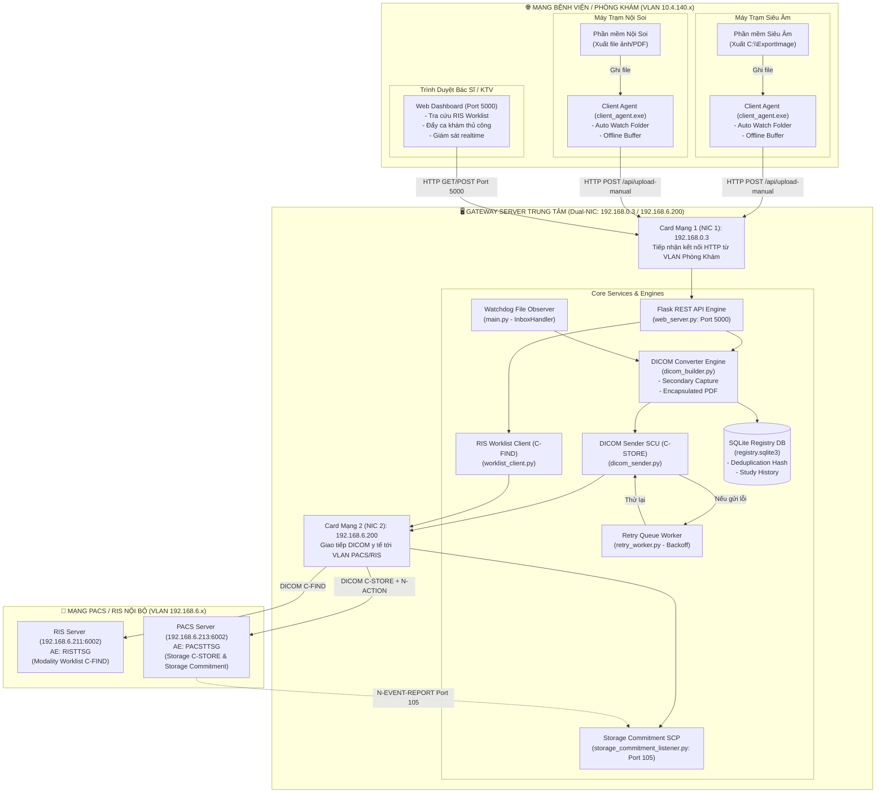
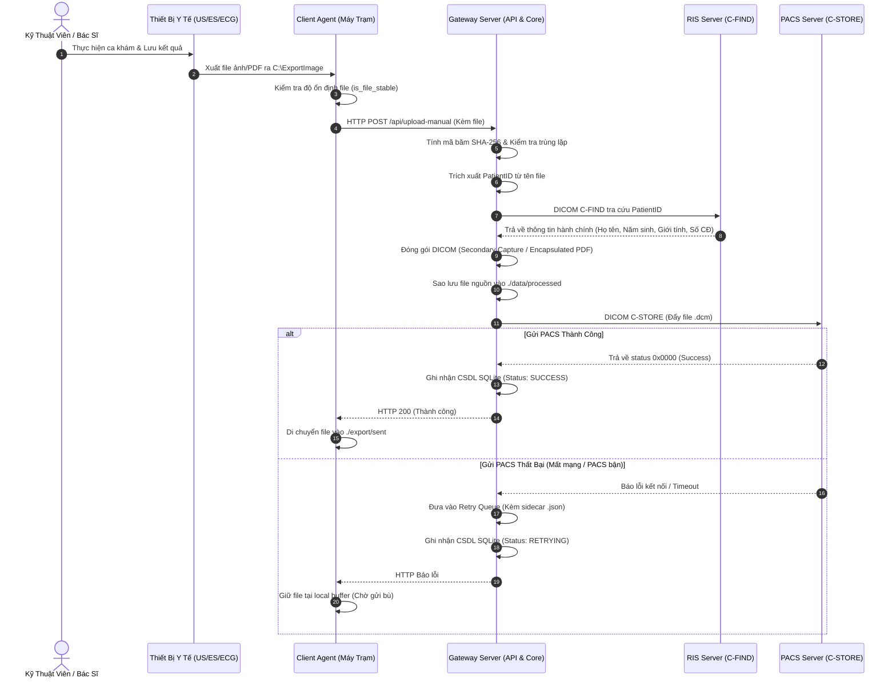
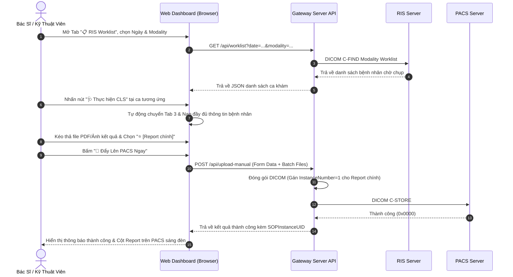

# TỔNG QUAN KIẾN TRÚC & CHỨC NĂNG HỆ THỐNG DICOM GATEWAY SERVICE (NON-DICOM CONVERTER)

---

## 📌 1. TỔNG QUAN DỰ ÁN (EXECUTIVE OVERVIEW)

**DICOM Gateway Service** (Non-DICOM Converter) là giải pháp phần mềm trung gian y tế (Medical Middleware Gateway) đóng vai trò làm cầu nối giữa các thiết bị y tế cận lâm sàng **không có chuẩn DICOM gốc** (hoặc không có bản quyền module DICOM của hãng) với hệ thống lưu trữ và truyền hình ảnh y tế **PACS** (Picture Archiving and Communication System) và hệ thống thông tin chẩn đoán hình ảnh **RIS** (Radiology Information System).

### 🎯 Mục tiêu & Bài toán giải quyết:
1. **Thu thập & Đóng gói dữ liệu phi DICOM**: Tự động chuyển đổi các định dạng ảnh (.png, .jpg, .jpeg) và tài liệu kết quả (.pdf) từ các máy thăm dò chức năng, chẩn đoán hình ảnh thành file **DICOM Chuẩn Quốc Tế** (DICOM PS3.x).
2. **Tự động hóa thông tin ca khám (RIS Modality Worklist)**: Tích hợp giao thức `DICOM C-FIND` tra cứu thông tin hành chính của bệnh nhân (Họ tên, Năm sinh, Giới tính, Mã bệnh nhân, Số chỉ định/Accession Number, Tên dịch vụ) từ RIS, loại bỏ hoàn toàn việc gõ tay thông tin, tránh sai sót dữ liệu y tế.
3. **Đẩy dữ liệu an toàn vào PACS**: Sử dụng giao thức chuẩn `DICOM C-STORE` để lưu trữ dữ liệu vào PACS Server trung tâm, hỗ trợ cơ chế xác nhận lưu trữ `Storage Commitment` (`N-ACTION` / `N-EVENT-REPORT`).
4. **Cách ly mạng y tế (Network Isolation / Dual-NIC)**: Đảm bảo an ninh thông tin bệnh viện bằng cách thiết lập máy chủ Gateway làm cầu nối giữa VLAN phòng khám của các máy trạm thiết bị (`10.4.140.x`) và VLAN máy chủ PACS/RIS (`192.168.6.x`).
5. **Đảm bảo không mất mát dữ liệu (Zero Data Loss Guarantee)**: Cơ chế đệm ngoại tuyến (Offline Buffer) tại máy trạm và hàng đợi tự động thử lại (Retry Queue với Exponential Backoff) tại máy chủ khi có sự cố mạng hoặc PACS gián đoạn.

---

## 🏗️ 2. MÔ HÌNH KIẾN TRÚC TỔNG THỂ (SYSTEM ARCHITECTURE)

Hệ thống hoạt động theo mô hình **Client - Server Phân Tách** kết hợp thiết lập mạng kép **Dual-NIC Bridge**:



---

## 🧩 3. CÁC THÀNH PHẦN HỆ THỐNG & MODULE CHI TIẾT

Hệ thống bao gồm 2 phân hệ chính: **Gateway Server Trung Tâm** và **Client Agent tại Máy Trạm**.

### 3.1. Phân Hệ Gateway Server Trung Tâm (Backend & DICOM Engine)

| Tên File | Thành phần / Module | Vai trò & Trách nhiệm chính |
| :--- | :--- | :--- |
| [`main.py`](file:///e:/Work/Apps/TTSG_Dicom_Gateway/main.py) | **Main Service Entrypoint** | • Điểm khởi động toàn bộ service nền của Gateway.<br>• Khởi tạo File Watchdog Observer theo dõi các thư mục Inbox theo Modality.<br>• Quản lý luồng xử lý `GatewayWorker`, điều phối chuyển đổi DICOM, lưu trữ SQLite và gửi PACS.<br>• Xử lý tín hiệu tắt an toàn (Graceful Shutdown - `SIGINT`, `SIGTERM`). |
| [`dicom_builder.py`](file:///e:/Work/Apps/TTSG_Dicom_Gateway/dicom_builder.py) | **DICOM Converter Engine** | • Đóng gói ảnh (`.png`, `.jpg`, `.jpeg`) thành `Secondary Capture Image Storage` hoặc SOP Class chuyên biệt (`Ultrasound`, `CR`, `DX`).<br>• Đóng gói tài liệu (`.pdf`) thành `Encapsulated PDF Storage` (hoặc rasterize ảnh nếu cấu hình yêu cầu).<br>• Chuẩn hóa dữ liệu UTF-8 (`ISO_IR 192`), loại bỏ ký tự `^`, chuẩn hóa Ngày/Giờ (`StudyDate`, `StudyTime`, `PatientBirthDate`).<br>• Sinh Deterministic UID và thiết lập phân định File Report chính (`InstanceNumber=1`) vs File phụ (`InstanceNumber=2,3...`). |
| [`dicom_sender.py`](file:///e:/Work/Apps/TTSG_Dicom_Gateway/dicom_sender.py) | **DICOM C-STORE SCU** | • Thiết lập kết nối DICOM Association tới PACS Server.<br>• Truyền tải file DICOM qua dịch vụ `C-STORE`.<br>• Kiểm tra kết nối nhanh qua lệnh `C-ECHO` (Verification).<br>• Gửi yêu cầu `Storage Commitment` (`N-ACTION`) trong cùng association sau khi C-STORE thành công. |
| [`worklist_client.py`](file:///e:/Work/Apps/TTSG_Dicom_Gateway/worklist_client.py) | **RIS MWL C-FIND SCU** | • Kết nối tới RIS Server qua giao thức `DICOM C-FIND` (Modality Worklist Information Find).<br>• Tra cứu tự động thông tin bệnh nhân qua `PatientID` để bổ sung metadata chính xác cho file ảnh.<br>• Cung cấp hàm `query_worklist` phục vụ lọc danh sách ca chỉ định trên Web Dashboard theo ngày, mã BN, tên BN, Modality. |
| [`retry_worker.py`](file:///e:/Work/Apps/TTSG_Dicom_Gateway/retry_worker.py) | **Retry Queue Daemon** | • Quét định kỳ thư mục hàng đợi `./data/queue/retry`.<br>• Đọc file metadata sidecar `.json` để kiểm tra thời điểm thử lại kế tiếp.<br>• Áp dụng thuật toán độ trễ tăng dần (**Exponential Backoff** theo lịch: `300s`, `900s`, `3600s`, `7200s`, `21600s`).<br>• Tự động chuyển file sang thư mục `failed/` khi vượt quá số lần thử tối đa (`max_attempts: 10`). |
| [`storage_commitment_listener.py`](file:///e:/Work/Apps/TTSG_Dicom_Gateway/storage_commitment_listener.py) | **Storage Commitment SCP** | • Khởi chạy DICOM Listener lắng nghe trên cổng chuyên biệt (mặc định Port `105`).<br>• Tiếp nhận thông điệp xác nhận `N-EVENT-REPORT` gửi ngược từ PACS Server.<br>• Ghi nhận các `SOPInstanceUID` đã lưu vĩnh viễn (`ReferencedSOPSequence`) hoặc bị từ chối (`FailedSOPSequence`). |
| [`web_server.py`](file:///e:/Work/Apps/TTSG_Dicom_Gateway/web_server.py) | **Flask Web API & REST Server** | • Cung cấp RESTful API và giao diện Web Dashboard quản trị trên Port `5000`.<br>• Cung cấp các endpoint: trạng thái hệ thống, cập nhật `config.yaml`, kiểm tra C-ECHO PACS/RIS, truy vấn Worklist, đẩy ca khám thủ công/batch upload, xem log realtime, kích hoạt retry tức thời. |
| [`utils.py`](file:///e:/Work/Apps/TTSG_Dicom_Gateway/utils.py) | **Utility & SQLite Registry** | • `ProcessedRegistry`: Quản lý CSDL SQLite (`registry.sqlite3`) chống xử lý trùng lặp dựa trên băm SHA-256 (`processed_files`) và lưu vết lịch sử ca chụp (`studies`).<br>• `wait_for_stable_file`: Kiểm tra tính ổn định dung lượng file trước khi xử lý.<br>• `extract_metadata_from_filename`: Trích xuất thông tin bệnh nhân từ quy tắc đặt tên file bằng Regex kết hợp thuật toán phân tách dự phòng.<br>• Quản lý cấu hình YAML (`load_config`, `save_config`) và hệ thống xoay vòng log (`TimedRotatingFileHandler`). |

---

### 3.2. Phân Hệ Client Agent tại Máy Trạm Phòng Khám

| Tên File / Thư mục | Vai trò & Chức năng |
| :--- | :--- |
| [`client_agent.py`](file:///e:/Work/Apps/TTSG_Dicom_Gateway/client_agent.py) | • Tiến trình nền chạy siêu nhẹ tại các máy trạm thiết bị y tế (VLAN `10.4.140.x`).<br>• Tự động quét (Auto-watch) thư mục xuất file local (VD: `C:\ExportImage`).<br>• Đóng gói và gửi ngầm qua HTTP POST (`/api/upload-manual`) về Gateway Server `192.168.0.3:5000`.<br>• **Cơ chế Offline Buffer**: Khi mất mạng với Server, lưu tạm file tại `./export/sent` hoặc `./export/failed` và tự động gửi lại ngay khi kết nối mạng phục hồi. |
| [`client_config.yaml`](file:///e:/Work/Apps/TTSG_Dicom_Gateway/client_config.yaml) | • File cấu hình địa chỉ Gateway Server (`server_url`), thư mục theo dõi (`watch_folder`), thư mục lưu trữ (`sent_folder`, `failed_folder`) và tần suất quét (`poll_interval_sec`). |
| [`build_client_exe.bat`](file:///e:/Work/Apps/TTSG_Dicom_Gateway/build_client_exe.bat) | • Script đóng gói toàn bộ Client Agent thành **file thực thi độc lập (`dist/client_agent.exe`)** bằng PyInstaller, **không cần cài đặt Python** trên máy trạm. |
| [`run_client.bat`](file:///e:/Work/Apps/TTSG_Dicom_Gateway/run_client.bat) / [`setup_client.bat`](file:///e:/Work/Apps/TTSG_Dicom_Gateway/setup_client.bat) | • Script hỗ trợ khởi chạy và tạo môi trường ảo Python local (dành cho chế độ chạy mã nguồn). |

---

### 3.3. Công Cụ Chẩn Đoán & Giả Lập (Diagnostic & Testing Tools)

| Tên File | Mục đích sử dụng |
| :--- | :--- |
| [`mock_pacs_server.py`](file:///e:/Work/Apps/TTSG_Dicom_Gateway/mock_pacs_server.py) | Giả lập máy chủ PACS Server hỗ trợ nhận C-STORE và phản hồi C-ECHO (Port `11112` / AE: `PACS_SERVER`), lưu file vào `./data/mock_pacs_received` để test cục bộ không cần PACS thật. |
| [`mock_ris_server.py`](file:///e:/Work/Apps/TTSG_Dicom_Gateway/mock_ris_server.py) | Giả lập máy chủ RIS Modality Worklist hỗ trợ C-FIND (Port `6002` / AE: `RISTTSG`) trả về bản ghi bệnh nhân mẫu. |
| [`inspect_pacs_query.py`](file:///e:/Work/Apps/TTSG_Dicom_Gateway/inspect_pacs_query.py) | Công cụ chẩn đoán: Hỏi trực tiếp database của PACS Server qua `DICOM C-FIND (StudyRootQueryRetrieve)` để xác minh file đã lưu thành công trong CSDL PACS hay chưa (tách biệt lỗi hiển thị trên Web Viewer của PACS). |
| [`inspect_worklist_raw.py`](file:///e:/Work/Apps/TTSG_Dicom_Gateway/inspect_worklist_raw.py) | Công cụ chẩn đoán: Dump toàn bộ dataset thô từ RIS Worklist để phân tích các thẻ mở rộng (như `FillerOrderNumber`, `RequestedProcedureID`...). |
| [`test_pacs_connection.py`](file:///e:/Work/Apps/TTSG_Dicom_Gateway/test_pacs_connection.py) | Kiểm tra kết nối C-ECHO tới PACS được cấu hình trong `config.yaml`. |

---

## 📊 4. DANH SÁCH MODALITY & QUY CHUẨN ĐÓNG GÓI DICOM

Hệ thống đã chuẩn hóa các loại thiết bị y tế (Modality) và quy tắc tạo thẻ DICOM Metadata:

### 4.1. Bảng Phân Loại Modality Chuẩn Quốc Tế

| Mã Modality | Tên Tiếng Việt | Tên Tiếng Anh (DICOM Standard) | SOP Class UID Tương Ứng |
| :---: | :--- | :--- | :--- |
| **`CR`** | X-quang kỹ thuật số | Computed Radiography | `1.2.840.10008.5.1.4.1.1.1` (CR Image Storage) |
| **`DX`** / **`XQ`** | X-quang số trực tiếp | Digital Radiography | `1.2.840.10008.5.1.4.1.1.1.1` (Digital X-Ray Image Storage) |
| **`US`** | Siêu âm | Ultrasound | `1.2.840.10008.5.1.4.1.1.6.1` (Ultrasound Image Storage) |
| **`ES`** | Nội soi | Endoscopy | `1.2.840.10008.5.1.4.1.1.7` (Secondary Capture Image) |
| **`ECG`** | Điện tâm đồ | Electrocardiogram | `1.2.840.10008.5.1.4.1.1.7` (Secondary Capture Image) |
| **`PFT`** | Đo chức năng hô hấp | Pulmonary Function Test | `1.2.840.10008.5.1.4.1.1.7` (Secondary Capture Image) |
| **`BD`** | Đo mật độ xương | Bone Density / DEXA | `1.2.840.10008.5.1.4.1.1.7` (Secondary Capture Image) |
| **`DOC`** | Báo cáo kết quả / PDF | Encapsulated Document | `1.2.840.10008.5.1.4.1.1.104.1` (Encapsulated PDF Storage) |
| **`OT`** | Thiết bị khác | Other | `1.2.840.10008.5.1.4.1.1.7` (Secondary Capture Image) |

---

### 4.2. Quy Chuẩn Kích Hoạt Cột Báo Cáo (Report) Trên Hệ Thống PACS

Để phần mềm PACS nhận diện chính xác đâu là **Phiếu Kết Quả Chính** và đâu là **Ảnh / Tài liệu phụ**, Gateway tự động gán cấu trúc thẻ DICOM:

| Thẻ DICOM (Tag) | Thuộc tính DICOM | File Phiếu Kết Quả Chính (Main Report) | Các File Ảnh / Tài Liệu Phụ Đính Kèm |
| :--- | :--- | :--- | :--- |
| **`(0020,0013)`** | `InstanceNumber` | **`1`** *(Xếp ưu tiên vị trí số 1 trên PACS)* | `2`, `3`, `4`, `5`... |
| **`(0020,0011)`** | `SeriesNumber` | **`1`** *(Series báo cáo chẩn đoán)* | `2` *(Series tệp đính kèm)* |
| **`(0042,0010)`** | `DocumentTitle` | **`PHIẾU KẾT QUẢ CẬN LÂM SÀNG`** | `Tài liệu đính kèm ([Tên file gốc])` |
| **`(0008,103E)`** | `SeriesDescription` | **`Diagnostic Report`** | `Attachment` |
| **`(0010,0010)`** | `PatientName` | Đã chuẩn hóa: Xóa toàn bộ ký tự `^` và `_` | Đã chuẩn hóa: Xóa toàn bộ ký tự `^` và `_` |
| **`(0008,0005)`** | `SpecificCharacterSet` | `ISO_IR 192` (Chuẩn Unicode UTF-8) | `ISO_IR 192` (Chuẩn Unicode UTF-8) |

---

## 🖥️ 5. GIAO DIỆN ĐIỀU KHIỂN NGUYÊN KHỐI (WEB CONTROL PANEL)

Hệ thống tích hợp sẵn giao diện Web Dashboard hoàn chỉnh tại địa chỉ `http://<IP_GATEWAY>:5000` với 4 Tab nghiệp vụ:

```
┌──────────────────────────────────────────────────────────────────────────────────┐
│                             DICOM GATEWAY DASHBOARD                              │
├───────────────────┬───────────────────┬────────────────────┬─────────────────────┤
│ 📊 Tab 1:         │ 📋 Tab 2:         │ 📤 Tab 3:          │ 📜 Tab 4:           │
│ Tổng Quan & Log   │ RIS Worklist      │ Đẩy Ca PACS        │ Lịch Sử & Cấu Hình  │
└───────────────────┴───────────────────┴────────────────────┴─────────────────────┘
```

1. **Tab 1: 📊 Tổng Quan & Trạng Thái Hệ Thống**:
   * Hiển thị trạng thái hoạt động (Service Status, Thời gian chạy Uptime).
   * Thống kê trực quan: Số ca xử lý thành công (`processed`), Hàng đợi chờ thử lại (`retry`), Ca thất bại (`failed`), File trùng lặp (`duplicates`).
   * Xem terminal log realtime (200 dòng mới nhất) từ `gateway.log`.
2. **Tab 2: 📋 RIS Worklist**:
   * **Thanh tìm kiếm gom gọn (Single-line Compact Filter Bar)**: Lọc theo Ngày khám, Mã bệnh nhân, Họ tên bệnh nhân, Loại thiết bị (Modality).
   * Bảng danh sách bệnh nhân chờ chụp lấy trực tiếp từ RIS qua C-FIND.
   * Nút tác vụ nhanh **`🩺 Thực hiện CLS`**: Tự động chuyển màn hình sang Tab 3 và nạp toàn bộ thông tin bệnh nhân vào form mà không cần gõ lại.
3. **Tab 3: 📤 Nhập Ca Khám Thủ Công & Đẩy PACS**:
   * Form thông tin ca khám: Mã BN, Họ tên, Ngày khám, Số chỉ định (Accession No), Modality, Tên dịch vụ.
   * Menu chọn nhanh **Dịch vụ mẫu** (Siêu âm ổ bụng, Nội soi dạ dày, X-quang ngực, Điện tim...).
   * **Khu vực đính kèm file đa năng**: Kéo thả đồng thời nhiều file ảnh/PDF.
   * Giao diện chọn **`⭐ [Report chính]`** (nổi bật khung xanh viền sáng) để đánh dấu file phiếu kết quả.
   * Nút bấm **`🚀 Đẩy Lên PACS Ngay`**: Đóng gói và truyền trực tiếp lên PACS theo batch.
4. **Tab 4: 📜 Lịch Sử Ca Khám & Cấu Hình Kết Nối**:
   * Bảng tra cứu nhật ký lịch sử ca chụp từ SQLite Registry (hỗ trợ tìm kiếm, lọc theo trạng thái `SUCCESS`, `FAILED`, `RETRYING`, `DUPLICATE`).
   * Công cụ kiểm tra kết nối trực tiếp: Nút test **C-ECHO PACS** và **C-ECHO RIS**.
   * Trình chỉnh sửa cấu hình hệ thống `config.yaml` trực tiếp trên web.

---

## 🔄 6. CÁC QUY TRÌNH HOẠT ĐỘNG CHÍNH (OPERATIONAL WORKFLOWS)

### Quy Trình 1: Luồng Đẩy Tự Động Từ Máy Trạm (Automated File Flow)



---

### Quy Trình 2: Luồng Bán Tự Động Qua Web Dashboard (Worklist-Assisted Flow)



---

## 🔒 7. NGUYÊN TẮC AN TOÀN & BẢO TOÀN DỮ LIỆU (SAFETY & RESILIENCE)

1. **Cách ly mạng tuyệt đối (Air-Gap Protection)**:
   * Các máy trạm phòng khám `10.4.140.x` tuyệt đối không được cấp quyền truy cập mạng PACS/RIS `192.168.6.x`.
   * Mọi dữ liệu bắt buộc đi qua Gateway Server trung gian để kiểm duyệt định dạng, cấu trúc DICOM và chống mã độc.
2. **Nguyên tắc không mất mát dữ liệu (Zero Data Loss Guarantee)**:
   * **Tại Server**: File nguồn được backup vào `./data/processed` ngay khi đóng gói DICOM thành công, độc lập với kết quả gửi PACS. Nếu PACS lỗi, file DICOM được bảo lưu trong `./data/queue/retry` cùng sidecar `.json`.
   * **Tại Client**: Client Agent duy trì bộ đệm local (`./export/failed`). Khi đứt cáp mạng hoặc Server tắt, file không bị mất và sẽ gửi lại ngay khi Server online.
3. **Chống trùng lặp dữ liệu (Deduplication Registry)**:
   * Trước khi xử lý, mỗi file được tính toán mã băm SHA-256 (`file_hash`).
   * Nếu hash đã tồn tại trong bảng `processed_files`, file lập tức được chuyển sang `./data/duplicates` nhằm tránh tạo các study rác trên PACS.
4. **Kiểm tra file hoàn tất ghi (File Stability Check)**:
   * Trước khi đọc file từ thư mục Inbox, hệ thống kiểm tra dung lượng file qua nhiều lần liên tiếp (`stability_check_count: 3`, `interval: 2s`) để đảm bảo thiết bị y tế đã xuất file xong hoàn toàn, tránh đọc file dở dang gây hỏng cấu trúc ảnh.
5. **Chuẩn hóa Unicode & Tên Bệnh Nhân (Sanitization)**:
   * Toàn bộ dữ liệu DICOM sử dụng bảng mã chuẩn UTF-8 (`ISO_IR 192`).
   * Tự động loại bỏ ký tự phân cách dấu mũ `^` và dấu gạch dưới `_` trong tên bệnh nhân để hiển thị hoàn hảo trên các dòng máy PACS Viewer hiện đại.

---

## 📁 8. CẤU TRÚC THƯ MỤC DỰ ÁN (PROJECT STRUCTURE)

```
TTSG_Dicom_Gateway/
├── 📄 config.yaml                      # Cấu hình trung tâm Server (PACS, RIS, Watcher, Paths, Retry)
├── 📄 client_config.yaml               # Cấu hình mẫu cho Client Agent
├── 📄 requirements.txt                 # Danh sách thư viện Python phụ thuộc
│
├── 🐍 main.py                          # Điểm khởi chạy chính của Gateway Service & Watchdog
├── 🐍 dicom_builder.py                 # Module đóng gói DICOM (Secondary Capture / Encapsulated PDF)
├── 🐍 dicom_sender.py                  # Module gửi DICOM C-STORE SCU & Storage Commitment
├── 🐍 worklist_client.py               # Module tra cứu RIS Modality Worklist C-FIND SCU
├── 🐍 retry_worker.py                  # Tiến trình nền quét hàng đợi và tự động thử lại
├── 🐍 storage_commitment_listener.py   # Listener lắng nghe N-EVENT-REPORT từ PACS Server (Port 105)
├── 🐍 web_server.py                    # Flask REST API Server & Web Controller (Port 5000)
├── 🐍 utils.py                         # CSDL SQLite Registry, trích xuất Regex, Logging, Config helper
│
├── 📁 Client/                          # Thư mục bộ cài Client Agent độc lập cho máy trạm
│   ├── 🐍 client_agent.py              # Mã nguồn Client Agent theo dõi thư mục & đẩy HTTP
│   ├── 📄 client_config.yaml           # Cấu hình Client Agent
│   ├── 📜 run_client.bat               # Script khởi chạy Client
│   ├── 📜 setup_client.bat             # Script cài đặt môi trường Client
│   └── 📁 export/                      # Thư mục chứa dữ liệu xuất (sent / failed)
│
├── 📁 templates/                       # Giao diện Web Dashboard
│   └── 🌐 index.html                   # Giao diện nguyên khối (HTML5, CSS3, JS Vanilla, 4 Tabs)
│
├── 📁 data/                            # Thư mục lưu trữ dữ liệu vận hành
│   ├── 📁 dicom_staging/               # Vùng đệm tạo file .dcm tạm trước khi gửi
│   ├── 📁 inbox/                       # Thư mục nhận file tự động (Modality Inbox)
│   ├── 📁 processed/                   # Thư mục lưu trữ file nguồn & DICOM đã gửi thành công
│   ├── 📁 failed/                      # Thư mục chứa file lỗi hoặc vượt quá số lần retry
│   ├── 📁 duplicates/                  # Thư mục chứa file trùng lặp băm SHA-256
│   ├── 📁 queue/retry/                 # Hàng đợi retry (chứa file .dcm và .json sidecar)
│   └── 🗄️ registry.sqlite3            # CSDL SQLite lưu vết xử lý và lịch sử ca chụp
│
├── 📁 logs/                            # Nhật ký hoạt động xoay vòng theo ngày
│   └── 📄 gateway.log                  # File log chính của hệ thống
│
├── 📁 tests/                           # Bộ kiểm thử tự động (Unit Tests)
│   ├── 🐍 test_dicom_builder.py        # Kiểm thử đóng gói DICOM Image/PDF
│   ├── 🐍 test_utils.py                # Kiểm thử trích xuất metadata và SQLite Registry
│   ├── 🐍 test_web_server.py           # Kiểm thử các API REST Web Server
│   └── 🐍 test_client_agent.py         # Kiểm thử logic Client Agent
│
├── 🛠️ Các công cụ kiểm thử & Giả lập:
│   ├── 🐍 mock_pacs_server.py          # Giả lập PACS C-STORE/C-ECHO Server
│   ├── 🐍 mock_ris_server.py           # Giả lập RIS Worklist C-FIND Server
│   ├── 🐍 inspect_pacs_query.py        # Truy vấn trực tiếp database PACS qua C-FIND
│   ├── 🐍 inspect_worklist_raw.py      # Dump dữ liệu C-FIND thô từ RIS
│   ├── 🐍 test_pacs_connection.py      # Kiểm tra kết nối C-ECHO PACS
│   ├── 📜 run_mock_pacs.bat / .sh      # Script chạy nhanh Mock PACS Server
│   ├── 📜 run_mock_ris.bat / .sh       # Script chạy nhanh Mock RIS Server
│   └── 📜 test_ket_noi_pacs.bat / .sh  # Script chạy nhanh kiểm tra kết nối PACS
│
├── 📦 Scripts đóng gói & Triển khai:
│   ├── 📜 setup.bat / setup.sh         # Cài đặt môi trường ảo .venv và thư viện cho Server
│   ├── 📜 run.bat / run.sh             # Khởi chạy Gateway Server
│   └── 📜 build_client_exe.bat         # Đóng gói Client Agent thành file client_agent.exe độc lập
│
└── 📖 Tài liệu hướng dẫn:
    ├── 📄 PRD.md                       # Yêu cầu sản phẩm & Quy chuẩn kỹ thuật gốc
    └── 📄 guide.md                     # Sổ tay hướng dẫn cài đặt & vận hành chi tiết
```

---

## ⚙️ 9. BẢNG THÔNG SỐ CẤU HÌNH HỆ THỐNG (`config.yaml`)

```yaml
# Định dạng tên file để tự động trích xuất thông tin
filename_pattern:
  regex: '^(?P<patient_id>[A-Za-z0-9]+)_(?P<patient_name>[^_]+)_(?P<study_date>\d{8})'
  date_format: '%Y%m%d'

# Cấu hình ghi log
logging:
  level: INFO
  log_folder: ./logs
  retention_days: 90

# Thông số mặc định gán vào thẻ DICOM
metadata:
  default_value: UNKNOWN
  institution_name: My Clinic
  modality: OT
  specific_character_set: ISO_IR 192

# Cấu hình kết nối PACS Server
pacs:
  ip: 192.168.6.213
  port: 6002
  called_ae_title: PACSTTSG
  calling_ae_title: DICOM_GATEWAY
  connect_timeout_sec: 10
  storage_commitment:
    enabled: true
    listen_port: 105
    listen_ae_title: DICOM_GATEWAY

# Cấu hình kết nối RIS Modality Worklist Server
ris:
  enabled: true
  ip: 192.168.6.211
  port: 6002
  called_ae_title: RISTTSG
  calling_ae_title: DICOM_GATEWAY
  connect_timeout_sec: 10

# Đường dẫn các thư mục dữ liệu và CSDL SQLite
paths:
  dicom_staging_folder: ./data/dicom_staging
  processed_folder: ./data/processed
  failed_folder: ./data/failed
  duplicates_folder: ./data/duplicates
  retry_queue_folder: ./data/queue/retry
  registry_db: ./data/registry.sqlite3

# Cơ chế thử lại tự động (Exponential Backoff)
retry:
  scan_interval_sec: 300
  max_attempts: 10
  backoff_schedule_sec:
    - 300      # 5 phút
    - 900      # 15 phút
    - 3600     # 1 giờ
    - 7200     # 2 giờ
    - 21600    # 6 giờ

# Cấu hình giám sát thư mục
watcher:
  stability_check_interval_sec: 2
  stability_check_count: 3
  watch_folders:
    - path: ./data/inbox
      modality: US

# Cấu hình Web Dashboard
web_ui:
  enabled: true
  host: 0.0.0.0
  port: 5000
```

---

## 🎯 10. KẾT LUẬN & ĐÁNH GIÁ KIẾN TRÚC

Hệ thống **DICOM Gateway Service** được thiết kế nguyên khối, hoàn chỉnh, chuyên nghiệp và tối ưu cho môi trường y tế:
1. **Tuân thủ chuẩn y tế quốc tế**: Đóng gói chuẩn xác SOP Classes DICOM PS3.x (`Secondary Capture`, `Encapsulated PDF`), chuẩn hóa UTF-8 (`ISO_IR 192`), tương thích hoàn toàn với các hệ thống PACS phổ biến (GE, Siemens, Philips, BKPACS, iDiVi...).
2. **Tự động hóa thông minh**: Tích hợp RIS Worklist C-FIND giúp triệt tiêu thao tác nhập liệu thủ công.
3. **Độ tin cậy & an toàn cao**: Kiến trúc Dual-NIC bảo vệ mạng y tế, cơ chế băm SHA-256 chống lặp, SQLite Registry ghi vết đầy đủ, và cơ chế Retry Queue đảm bảo **100% không mất dữ liệu**.
4. **Vận hành linh hoạt**: Hỗ trợ đồng thời chế độ **Đẩy tự động ngầm qua Client Agent** và **Thao tác bán tự động trực quan qua Web Dashboard**.
