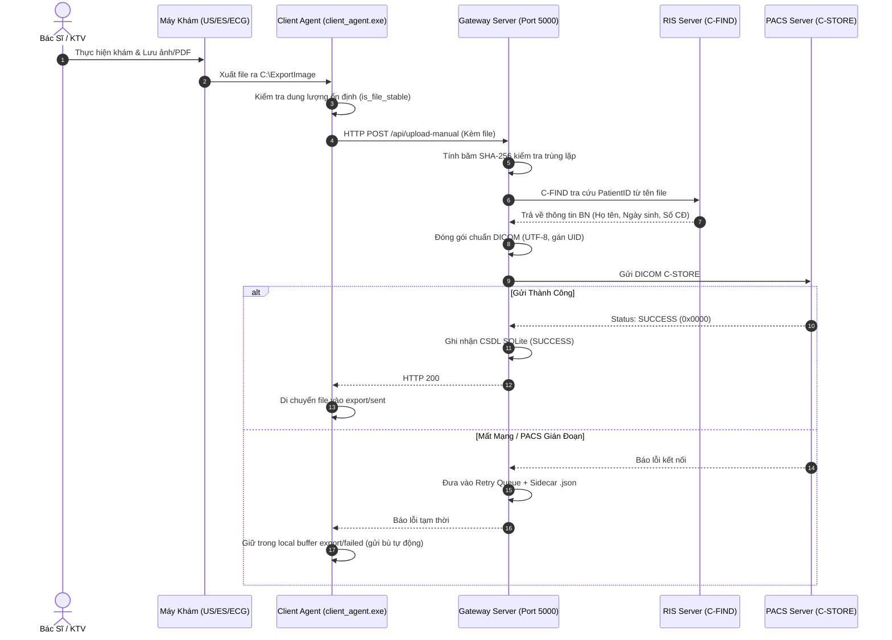
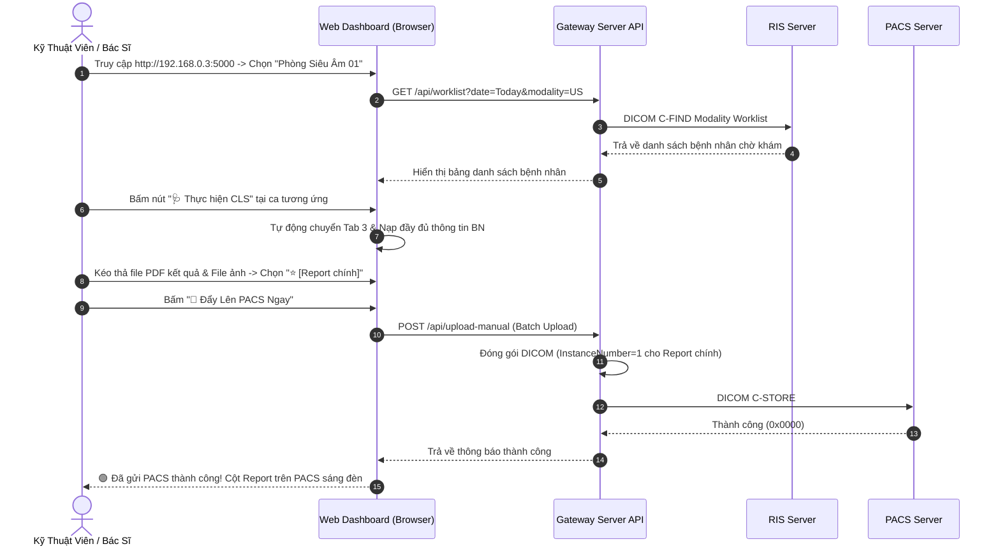

# 📘 TÀI LIỆU TOÀN DIỆN HỆ THỐNG TTSG DICOM GATEWAY
### (Đóng Gói - Triển Khai - Cấu Hình Chi Tiết - Bản Quyền - Nâng Cấp - Vận Hành Chức Năng)

---

## 📌 MỤC LỤC TỔNG QUAN
1. [1. Tổng Quan Kiến Trúc Kỹ Thuật & Mô Hình Mạng](#1-tổng-quan-kiến-trúc-kỹ-thuật--mô-hình-mạng)
2. [2. Hướng Dẫn Đóng Gói Phần Mềm (Packaging Guide)](#2-hướng-dẫn-đóng-gói-phần-mềm-packaging-guide)
3. [3. Hướng Dẫn Triển Khai Cho Site Mới (Site Deployment & Detailed Config)](#3-hướng-dẫn-triển-khai-cho-site-mới-site-deployment--detailed-config)
4. [4. Cấp Phát & Quản Lý Bản Quyền Thương Mại (RSA 2048-bit Licensing)](#4-cấp-phát--quản-lý-bản-quyền-thương-mại-rsa-2048-bit-licensing)
5. [5. Đóng Gói & Cập Nhật Nâng Cấp Phiên Bản Mới (.pkg Hot Patching)](#5-đóng-gói--cập-nhật-nâng-cấp-phiên-bản-mới-pkg-hot-patching)
6. [6. Quy Trình Tổng Thể Sử Dụng Phần Mềm (End-to-End Workflows)](#6-quy-trình-tổng-thể-sử-dụng-phần-mềm-end-to-end-workflows)
7. [7. Hướng Dẫn Chi Tiết Từng Chức Năng & Thao Tác Giao Diện (UI Walkthrough)](#7-hướng-dẫn-chi-tiết-từng-chức-năng--thao-tác-giao-diện-ui-walkthrough)
8. [8. Quản Trị Hệ Thống Nâng Cao & Xử Lý Sự Cố (Troubleshooting)](#8-quản-trị-hệ-thống-nâng-cao--xử-lý-sự-cố-troubleshooting)

---

# 1. TỔNG QUAN KIẾN TRÚC KỸ THUẬT & MÔ HÌNH MẠNG

**TTSG DICOM Gateway** là phần mềm trung gian y tế (*Medical Middleware Gateway*) đóng vai trò cầu nối chuẩn hóa giữa các thiết bị y tế cận lâm sàng không có chuẩn DICOM (hoặc kết quả dạng JPG, PNG, PDF) với hệ thống lưu trữ hình ảnh **PACS** và hệ thống thông tin chỉ định **HIS/RIS (Modality Worklist)**.

```
                  ┌─────────────────────────────────────────────────────────┐
                  │              BỆNH VIỆN / PHÒNG KHÁM ĐA KHOA             │
                  └─────────────────────────────────────────────────────────┘
                                                │
          ┌─────────────────────────────────────┴─────────────────────────────────────┐
          ▼                                                                           ▼
┌─────────────────────────────────┐                                         ┌─────────────────────────────────┐
│   VLAN 1: MẠNG PHÒNG KHÁM LAN   │                                         │  VLAN 2: MẠNG NỘI BỘ PACS / RIS │
│ (Dải IP: 192.168.0.x / 10.x.x)  │                                         │   (Dải IP: 192.168.6.x Cô lập)  │
└────────────────┬────────────────┘                                         └────────────────┬────────────────┘
                 │                                                                           │
                 │   [NIC 1: 192.168.0.3]                               [NIC 2: 192.168.6.200]│
                 └───────────────────► ┌───────────────────────────┐ ◄───────────────────────┘
                                       │   TTSG DICOM GATEWAY      │
                                       │ - Windows Service 24/7    │
                                       │ - Waitress WSGI Web Engine│
                                       │ - DICOM PS3.x Converter   │
                                       │ - RSA 2048-bit Security   │
                                       └─────────────┬─────────────┘
                                                     │
         ┌───────────────────────────────────────────┼───────────────────────────────────────────┐
         ▼                                           ▼                                           ▼
┌─────────────────────────────┐             ┌─────────────────────────────┐             ┌─────────────────────────────┐
│    PHÒNG SIÊU ÂM (US)       │             │    PHÒNG NỘI SOI (ES)       │             │   ĐIỆN TIM / X-QUANG (ECG)  │
│ - Mở Web: 192.168.0.3:5000  │             │ - Mở Web: 192.168.0.3:5000  │             │ - Mở Web: 192.168.0.3:5000  │
│ - Chọn "Phòng Siêu Âm 01"   │             │ - Chọn "Phòng Nội Soi 01"   │             │ - Chọn "Phòng Điện Tim 01"  │
│ - Kéo ảnh -> Đẩy PACS       │             │ - Kéo ảnh -> Đẩy PACS       │             │ - Kéo ảnh -> Đẩy PACS       │
└─────────────────────────────┘             └─────────────────────────────┘             └─────────────────────────────┘
```

### 🏷️ Bảng Phân Loại Modality & Chuẩn Đóng Gói DICOM
| Modality Code | Tên Tiếng Việt | Tên Tiếng Anh | SOP Class UID Chuẩn Quốc Tế |
| :---: | :--- | :--- | :--- |
| **`US`** | Siêu âm (2D/3D/4D, Tim mạch) | Ultrasound | `1.2.840.10008.5.1.4.1.1.6.1` (Ultrasound Image Storage) |
| **`ES`** | Nội soi tiêu hóa, tai mũi họng | Endoscopy | `1.2.840.10008.5.1.4.1.1.7` (Secondary Capture Image) |
| **`ECG`** | Điện tâm đồ / Điện não / Điện cơ | Electrocardiogram | `1.2.840.10008.5.1.4.1.1.7` (Secondary Capture Image) |
| **`CR`** | X-quang kỹ thuật số | Computed Radiography | `1.2.840.10008.5.1.4.1.1.1` (CR Image Storage) |
| **`DX`** | X-quang số trực tiếp | Digital Radiography | `1.2.840.10008.5.1.4.1.1.1.1` (Digital X-Ray Image) |
| **`BD`** | Đo mật độ xương (DEXA) | Bone Density | `1.2.840.10008.5.1.4.1.1.7` (Secondary Capture Image) |
| **`PFT`** | Đo chức năng hô hấp | Pulmonary Function Test | `1.2.840.10008.5.1.4.1.1.7` (Secondary Capture Image) |
| **`DOC`** | Báo cáo kết quả PDF | Document PDF | `1.2.840.10008.5.1.4.1.1.104.1` (Encapsulated PDF) |

---

# 2. HƯỚNG DẪN TẠO FILE .EXE ĐỂ CÀI ĐẶT (SỬ DỤNG CÁC FILE .BAT)

Đây là hướng dẫn **cầm tay chỉ việc** chi tiết nhất để bất kỳ ai (dù không biết lập trình) cũng có thể tự tạo ra file cài đặt `.exe`:

---

### 🛠️ KHÂU CHUẨN BỊ (Chỉ làm 1 lần duy nhất trên máy phát triển của bạn):
1. Cài đặt **Python 3.10+** (Lúc cài nhớ tick chọn ô: `☑️ Add Python to PATH`).
2. Cài đặt phần mềm miễn phí **Inno Setup 6** (Tải tại: [jrsoftware.org/isdl.php](https://jrsoftware.org/isdl.php) $\rightarrow$ Cứ bấm Next $\rightarrow$ Next $\rightarrow$ Install là xong).

---

### 👉 QUY TRÌNH 4 BƯỚC THAO TÁC CỰC KỲ ĐƠN GIẢN:

```
┌─────────────────────────────────────────────────────────────────────────────┐
│                    QUY TRÌNH TẠO FILE .EXE BẰNG FILE .BAT                   │
└─────────────────────────────────────────────────────────────────────────────┘
                                       │
  [BƯỚC 1: KHỞI TẠO THƯ VIỆN]          │ Nhấp đúp chuột vào: 👉 setup.bat
  (Làm lần đầu để tải thư viện)        ▼
                                       │ Màn hình hiện: === Cai dat xong ===
                                       │
  [BƯỚC 2: TẠO FILE CÀI ĐẶT SERVER]    │ Nhấp đúp chuột vào: 👉 build_setup_installer.bat
  (File Setup.exe cho máy chủ)         ▼
                                       │ 📦 TẠO RA: dist\TTSG_DicomGateway_Setup_v2.0.exe (~18MB)
                                       │ (Đây là file duy nhất mang đi cài đặt ở máy chủ bệnh viện!)
                                       │
  [BƯỚC 3: TẠO FILE MÁY TRẠM PHÒNG]    │ Nhấp đúp chuột vào: 👉 build_client_exe.bat
  (Dành cho máy trạm quét ảnh ngầm)    ▼
                                       │ 📦 TẠO RA: dist\client_agent.exe (~10MB)
                                       │
  [BƯỚC 4: TẠO FILE NÂNG CẤP BẢN VÁ]   │ Nhấp đúp chuột vào: 👉 build_patch.bat
  (Khi có tính năng mới gửi cho BV)    ▼
                                       │ 📦 TẠO RA: TTSG_Gateway_Patch_v2.1.0.pkg
```

#### Chi tiết từng bước:
* **Bước 1: Nhấp đúp vào [`setup.bat`](file:///e:/Work/Apps/TTSG_Dicom_Gateway/setup.bat)**:
  - Script tự động tạo môi trường ảo `.venv` và tải các thư viện y tế cần thiết.
  - Khi hoàn tất, màn hình console báo `=== Cai dat xong ===`, nhấn phím bất kỳ để đóng.
* **Bước 2: Nhấp đúp vào [`build_setup_installer.bat`](file:///e:/Work/Apps/TTSG_Dicom_Gateway/build_setup_installer.bat)**:
  - Script tự động gọi [`build_server_exe.bat`](file:///e:/Work/Apps/TTSG_Dicom_Gateway/build_server_exe.bat) đóng gói backend thành mã máy nhị phân, sau đó dùng Inno Setup nén lại thành 1 file cài đặt duy nhất.
  - **Kết quả xuất hiện**: 📦 **`dist\TTSG_DicomGateway_Setup_v2.0.exe`** (~18 MB). Đây là file mang đi bàn giao và cài đặt ở máy chủ bệnh viện.
* **Bước 3: Nhấp đúp vào [`build_client_exe.bat`](file:///e:/Work/Apps/TTSG_Dicom_Gateway/build_client_exe.bat)**:
  - Script tự động đóng gói tiến trình nền máy trạm.
  - **Kết quả xuất hiện**: 📦 **`dist\client_agent.exe`** (~10 MB).
* **Bước 4: Nhấp đúp vào [`build_patch.bat`](file:///e:/Work/Apps/TTSG_Dicom_Gateway/build_patch.bat)**:
  - Nhập số phiên bản (VD: `2.1.0`) và nhấn Enter.
  - **Kết quả xuất hiện**: 📦 **`TTSG_Gateway_Patch_v2.1.0.pkg`**. Gửi file này cho IT Bệnh viện để họ cập nhật trực tiếp trên Web trong 3 giây.

---

### 📋 BẢNG TRA CỨU NHANH CÁC FILE .BAT:
| File .bat | Thao tác | Ai sử dụng? | Mục đích & Kết quả |
| :--- | :--- | :--- | :--- |
| **`setup.bat`** | Nhấp đúp chuột | Người phát triển | Khởi tạo thư viện và môi trường ảo Python local `.venv`. |
| **`build_setup_installer.bat`** | Nhấp đúp chuột | Người phát triển | **Tạo file cài đặt 1-Click duy nhất:** `dist\TTSG_DicomGateway_Setup_v2.0.exe`. |
| **`build_server_exe.bat`** | Tự động gọi | Hệ thống | Biên dịch Backend Flask sang thư mục nhị phân `dist\TTSG_DicomGateway\`. |
| **`build_client_exe.bat`** | Nhấp đúp chuột | Người phát triển | **Tạo file chạy cho máy trạm:** `dist\client_agent.exe`. |
| **`build_patch.bat`** | Nhấp đúp chuột | Người phát triển | **Tạo gói cập nhật nâng cấp:** `TTSG_Gateway_Patch_vX.X.X.pkg`. |
| **`run.bat`** | Nhấp đúp chuột | Người kiểm thử | Chạy thử Server trực tiếp bằng Python để test tính năng. |
| **`test_ket_noi_pacs.bat`** | Nhấp đúp chuột | Kỹ sư triển khai | Kiểm tra kết nối mạng C-ECHO tới PACS xem có thông không. |

---

# 3. HƯỚNG DẪN TRIỂN KHAI CHO SITE MỚI (SITE DEPLOYMENT & DETAILED CONFIG)

### 3.1. Khảo Sát Thông Số Hạ Tầng Từ Bệnh Viện
Trước khi triển khai, gửi phiếu khảo sát cho IT Bệnh viện điền thông tin:

| STT | Hạng mục khảo sát | Ý nghĩa kỹ thuật | Ví dụ thực tế |
| :---: | :--- | :--- | :--- |
| **1** | **PACS Server IP** | Địa chỉ IP máy chủ lưu trữ PACS | `192.168.6.213` |
| **2** | **PACS Port** | Cổng lắng nghe DICOM C-STORE của PACS | `6002` (hoặc `104`) |
| **3** | **PACS Called AE Title** | Tên định danh DICOM của PACS Server | `PACSTTSG` |
| **4** | **Gateway Calling AE Title** | Tên AE Title của Gateway đăng ký với PACS | `DICOM_GATEWAY` |
| **5** | **RIS / Worklist Server IP** | Địa chỉ máy chủ Worklist HIS/RIS | `192.168.6.211` |
| **6** | **RIS Port & AE Title** | Cổng & Tên định danh RIS Worklist | `6002` / `RISTTSG` |
| **7** | **IP Máy Gateway Server** | IP mạng phòng khám (NIC 1) & IP mạng PACS (NIC 2) | NIC 1: `192.168.0.3`<br>NIC 2: `192.168.6.200` |

> [!IMPORTANT]
> **Nhắc IT Bệnh Viện Cấu Hình PACS Server**:
> Yêu cầu IT Bệnh viện vào phần mềm PACS thêm mới 1 DICOM Node:
> - **AE Title**: `DICOM_GATEWAY`
> - **IP Address**: `192.168.6.200` (IP của Card mạng số 2 Gateway)
> - **Port**: `105` (nếu có dùng Storage Commitment)

---

### 3.2. Cấu Hình Card Mạng Kép (Dual-NIC Setup) & Windows Firewall

1. **Card mạng 1 (NIC 1) - Nối mạng nội bộ phòng khám / bệnh viện (`192.168.0.3`)**:
   - IP Address: `192.168.0.3`
   - Subnet Mask: `255.255.255.0`
   - Default Gateway: `192.168.0.1` *(Điền Gateway của mạng bệnh viện)*
   - DNS: `8.8.8.8`
2. **Card mạng 2 (NIC 2) - Nối mạng nội bộ PACS / RIS (`192.168.6.200`)**:
   - IP Address: `192.168.6.200`
   - Subnet Mask: `255.255.255.0`
   - **Default Gateway: ĐỂ TRỐNG (BLANK)** *(Tuyệt đối không điền Default Gateway tại NIC 2 để tránh xung đột định tuyến hệ thống)*
3. **Mở cổng Firewall trên Server**:
   - Mở Inbound **TCP Port 5000** (Web Dashboard & REST API).
   - Mở Inbound **TCP Port 105** (Storage Commitment Listener).

---

### 3.3. Cài Đặt 1-Click Bằng File `Setup.exe`
1. Nhấp đúp vào file **`TTSG_DicomGateway_Setup_v2.0.exe`**.
2. Chọn thư mục cài đặt: `C:\Program Files\TTSG DICOM Gateway` $\rightarrow$ Bấm **Next**.
3. Tick chọn **"Create a desktop icon"** $\rightarrow$ Bấm **Install**.
4. Trình cài đặt sẽ tự động:
   - Giải nén mã máy nhị phân C/C++.
   - Đăng ký dịch vụ **Windows Service (`TTSG_DicomGateway`)** tự chạy cùng Windows 24/7 (tự phục hồi sau 5s nếu có sự cố).
   - Mở cổng tường lửa Windows Firewall (Port 5000 & 105).
   - Tạo biểu tượng trên Desktop và mở trình duyệt web quản trị `http://localhost:5000`.

---

### 3.4. Cấu Hình Chi Tiết File `config.yaml`
Sau khi cài đặt, bạn có thể chỉnh sửa trực tiếp qua Tab **Cấu Hình** trên Web hoặc mở file `config.yaml`:

```yaml
# ==============================================================================
# CẤU HÌNH HỆ THỐNG TTSG DICOM GATEWAY
# ==============================================================================

# 1. Cấu hình định dạng trích xuất thông tin bệnh nhân từ tên file (Regex)
filename_pattern:
  regex: '^(?P<patient_id>[A-Za-z0-9]+)_(?P<patient_name>[^_]+)_(?P<study_date>\d{8})'
  date_format: '%Y%m%d'

# 2. Cấu hình ghi log và xoay vòng
logging:
  level: INFO
  log_folder: ./logs
  retention_days: 90

# 3. Metadata mặc định khi thiếu thông tin
metadata:
  default_value: UNKNOWN
  institution_name: "Bệnh Viện Đa Khoa Tâm Trí Sài Gòn"
  modality: OT
  specific_character_set: ISO_IR 192   # Chuẩn UTF-8 Tiếng Việt

# 4. Cấu hình kết nối Máy Chủ PACS (C-STORE & Storage Commitment)
pacs:
  ip: 192.168.6.213
  port: 6002
  called_ae_title: PACSTTSG
  calling_ae_title: DICOM_GATEWAY
  connect_timeout_sec: 10
  storage_commitment:
    enabled: true
    listen_port: 105
    listen_ae_title: DICOM_GATEWAY

# 5. Cấu hình kết nối Máy Chủ RIS Worklist (C-FIND)
ris:
  enabled: true
  ip: 192.168.6.211
  port: 6002
  called_ae_title: RISTTSG
  calling_ae_title: DICOM_GATEWAY
  connect_timeout_sec: 10

# 6. Đường dẫn thư mục lưu trữ và CSDL SQLite
paths:
  dicom_staging_folder: ./data/dicom_staging
  processed_folder: ./data/processed
  failed_folder: ./data/failed
  duplicates_folder: ./data/duplicates
  retry_queue_folder: ./data/queue/retry
  registry_db: ./data/registry.sqlite3

# 7. Cơ chế tự động thử lại khi mất mạng / PACS gián đoạn (Exponential Backoff)
retry:
  scan_interval_sec: 300
  max_attempts: 10
  backoff_schedule_sec:
    - 300      # 5 phút
    - 900      # 15 phút
    - 3600     # 1 giờ
    - 7200     # 2 giờ
    - 21600    # 6 giờ

# 8. Cấu hình Web Control Panel & REST API
web_ui:
  enabled: true
  host: 0.0.0.0
  port: 5000

# 9. Cấu hình xác thực & phân quyền người dùng
auth:
  enabled: true
  session_lifetime_days: 30
  secret_key: "TTSG_DICOM_GATEWAY_SUPER_SECRET_KEY_2026"
  users:
    - username: trind
      password_hash: "scrypt:32768:8:1$UrmQhPzkp2t5PgFk$bd54e06b5cf6655d2aa25d5cbb7d8fa52b906d498a5813156c3ce8dd1eb208db0d60867f823390e1f786fd10da77bc635045254b1e95042d820b74c7c65108ee"
      full_name: "Quản Trị Viên Hệ Thống"
      role: "ADMIN"
      allowed_modalities: ["*"]

# 10. Danh sách các Trạm Phòng Khám (Stations) phục vụ KTV vào 1-chạm
stations:
  - id: "US_01"
    name: "Phòng Siêu âm 01 (Tổng quát)"
    department: "Khoa Chẩn đoán hình ảnh"
    allowed_modalities: ["US"]
    default_modality: "US"
    icon: "🩺"

  - id: "ES_01"
    name: "Phòng Nội soi Tiêu hóa 01"
    department: "Khoa Thăm dò chức năng"
    allowed_modalities: ["ES"]
    default_modality: "ES"
    icon: "🔬"

  - id: "ECG_01"
    name: "Phòng Điện tim & Thần kinh"
    department: "Khoa Thăm dò chức năng"
    allowed_modalities: ["ECG", "EEG", "EMG"]
    default_modality: "ECG"
    icon: "⚡"
```

---

# 4. CẤP PHÁT & QUẢN LÝ BẢN QUYỀN THƯƠNG MẠI (RSA 2048-BIT LICENSING)

Hệ thống kiểm soát bản quyền thương mại bằng công nghệ **khóa phần cứng (Hardware ID)** kết hợp chữ ký số **RSA 2048-bit + SHA-256**, chống giả mạo và chống nhân bản trái phép.

```
┌─────────────────────────────────────────────────────────────────────────────┐
│                    QUY TRÌNH CẤP PHÁT BẢN QUYỀN                             │
└─────────────────────────────────────────────────────────────────────────────┘
                                       │
  1. TẠI MÁY CHỦ KHÁCH HÀNG (GATEWAY SERVER):
     - Mở Web: http://localhost:5000 -> Đăng nhập Admin (trind / admin123)
     - Vào Tab: "🔑 Bản Quyền & Hệ Thống"
     - Nhấp nút: [📋 Sao Chép] để lấy Mã Hardware ID (VD: TTSG-6F6E-BCA7-82EA-C52B)
                                       │
                                       ▼
  2. TẠI MÁY CỦA NHÀ PHÁT TRIỂN / CẤP PHÉP:
     - Dùng công cụ license_generator.py để ký số tạo file license.key:
     python license_generator.py --customer "BV Đa Khoa Tâm Trí Sài Gòn" \
                                 --hwid "TTSG-6F6E-BCA7-82EA-C52B" \
                                 --exp "2035-12-31" \
                                 --modalities "US,ES,ECG,CR,DR,BD,PFT" \
                                 --stations 50 \
                                 --plan "Enterprise Medical Edition" \
                                 --out "license.key"
                                       │
                                       ▼
  3. TẠI GIAO DIỆN WEB KHÁCH HÀNG:
     - Chọn file license.key vừa tạo -> Bấm [🔑 Kích Hoạt Bản Quyền Ngay]
     - Màn hình báo: 🟢 BẢN QUYỀN HỢP LỆ (VALID) -> Kích hoạt vĩnh viễn!
```

### Các Tham Số Kiểm Soát Trong Bản Quyền:
* **`customer_name`**: Tên bệnh viện / đơn vị sở hữu bản quyền.
* **`hardware_id`**: Mã định danh kết hợp CPU ID, Serial bo mạch chủ và MAC Card mạng.
* **`expiration_date`**: Ngày hết hạn sử dụng (hoặc `PERMANENT` cho bản quyền vĩnh viễn).
* **`allowed_modalities`**: Danh sách loại máy được phép sử dụng (VD: `['US', 'ES', 'ECG', 'CR']`).
* **`max_stations`**: Số lượng trạm làm việc tối đa được phép cấu hình.

### ⏱️ Chính Sách Bản Dùng Thử (Demo Trial Edition):
* **Thời hạn mặc định**: Tự động cấp **30 ngày dùng thử (1 tháng)** kể từ lần đầu tiên hệ thống được cài đặt và khởi động trên máy chủ mới (nếu chưa nạp file `license.key`).
* **Giao diện trực quan**: Hiển thị thanh tiến trình đếm ngược 30 ngày (`Timeline Progress Bar`), thông báo số ngày còn lại và cảnh báo khi sắp hết hạn.
* **Sau khi hết hạn 30 ngày**: Trạng thái chuyển sang `🔴 EXPIRED (Đã Hết Hạn)`. Các luồng đẩy ảnh PACS và chuyển đổi DICOM sẽ yêu cầu nhập bản quyền thương mại để tiếp tục vận hành.

---

# 5. ĐÓNG GÓI & CẬP NHẬT NÂNG CẤP PHIÊN BẢN MỚI (.PKG HOT PATCHING)

Khi có bản vá sửa lỗi hoặc nâng cấp tính năng mới, nhà phát triển không cần phải cài lại phần mềm hay remote thao tác phức tạp. Hệ thống hỗ trợ tính năng **Cập nhật nóng 1-chạm qua Web bằng file `.pkg`**.

```
┌─────────────────────────────────────────────────────────────────────────────┐
│                    QUY TRÌNH ĐÓNG GÓI & CẬP NHẬT BẢN VÁ                     │
└─────────────────────────────────────────────────────────────────────────────┘
                                       │
  1. PHÍA NHÀ PHÁT TRIỂN (BUILD PATCH):
     - Chạy script: build_patch.bat
     - Nhập số phiên bản (VD: 2.1.0) và ghi chú cập nhật.
     - Script tự động gom binary mới, ký số RSA 2048-bit và tạo file:
       ==> TTSG_Gateway_Patch_v2.1.0.pkg
     - Gửi file này cho IT Bệnh viện qua Email / Zalo / USB.
                                       │
                                       ▼
  2. PHÍA KHÁCH HÀNG / IT BỆNH VIỆN (APPLY PATCH):
     - Đăng nhập Web Admin -> Tab "🔑 Bản Quyền & Hệ Thống"
     - Tại mục "Nâng Cấp Bằng Bản Vá (.pkg)": Chọn file TTSG_Gateway_Patch_v2.1.0.pkg
     - Bấm [🚀 Cập Nhật Ngay]
     - Hệ thống xác thực chữ ký RSA -> Giải nén ghi đè mã máy trong 3 GIÂY.
     - Tự động tải lại trang web phiên bản mới!
```

> [!TIP]
> **Cam Kết Bảo Toàn Dữ Liệu 100% (Zero-Downtime Safe)**:
> Bộ nạp bản vá (`patch_builder.py` / `verify_and_apply_patch`) có cơ chế rào cản thông minh: **Tuyệt đối không bao giờ ghi đè lên file cấu hình `config.yaml`, CSDL SQLite `data/registry.sqlite3`, file bản quyền `license.key` hay nhật ký `logs/`**.

---

# 6. QUY TRÌNH TỔNG THỂ SỬ DỤNG PHẦN MỀM (END-TO-END WORKFLOWS)

### 🔹 Quy Trình 1: Đẩy Tự Động Từ Máy Trạm (Automated Background Pipeline)



---

### 🔹 Quy Trình 2: Bán Tự Động 1-Chạm Qua Web Dashboard (Worklist-Assisted)



---

# 7. HƯỚNG DẪN CHI TIẾT TỪNG CHỨC NĂNG & THAO TÁC GIAO DIỆN (UI WALKTHROUGH)

Giao diện Web Control Panel được xây dựng nguyên khối theo phong cách Modern Medical Glassmorphism, tối ưu hóa tốc độ và không yêu cầu cài đặt phần mềm bổ trợ.

```
┌────────────────────────────────────────────────────────────────────────────────────────────────────────┐
│  🏥 TTSG DICOM GATEWAY CONTROL PANEL                                  🟢 Online | Station: US_01      │
├────────────────────┬────────────────────┬────────────────────┬────────────────────┬────────────────────┤
│  📊 TAB 1:         │  📋 TAB 2:         │  📤 TAB 3:          │  📜 TAB 4:         │  🔑 TAB 5:         │
│  Tổng Quan & Log   │  RIS Worklist      │  Đẩy Ca PACS        │  Lịch Sử & Cấu Hình│  Bản Quyền & Admin │
└────────────────────┴────────────────────┴────────────────────┴────────────────────┴────────────────────┘
```

---

### 7.1. Màn Hình Chọn Nơi Làm Việc (Trạm Phòng Khám - 1-Click Login)
* **Ý nghĩa**: Giúp kỹ thuật viên tại từng phòng chuyên biệt (Siêu âm, Nội soi, Điện tim...) vào thẳng môi trường làm việc của mình mà **không cần đăng nhập mật khẩu phức tạp**.
* **Các bước thao tác**:
  1. Mở trình duyệt tại máy phòng khám, truy cập `http://192.168.0.3:5000`.
  2. Màn hình xuất hiện danh sách các trạm:
     - 🩺 **Phòng Siêu âm 01 (Tổng quát)**
     - 🔬 **Phòng Nội soi Tiêu hóa**
     - ⚡ **Phòng Điện tâm đồ & Thần kinh**
     - 🦴 **Phòng Đo loãng xương (DEXA)**
  3. Nhấp chọn phòng khám tương ứng.
  4. Tick chọn ô: **`☑️ Ghi nhớ nơi làm việc trên máy này`**.
  5. Bấm nút: **`🚀 Vào Làm Việc Ngay`**.
  6. *Từ lần sau khi mở lại trình duyệt, hệ thống sẽ tự động chuyển thẳng vào Worklist của phòng đó.*

---

### 7.2. TAB 1: 📊 Tổng Quan & Trạng Thái Hệ Thống
* **Chức năng**: Theo dõi sức khỏe toàn diện của máy chủ Gateway theo thời gian thực.
* **Các thành phần hiển thị**:
  1. **Thanh Trạng Thái (Status Bar)**: Báo trạng thái dịch vụ (🟢 Đang chạy), Uptime, Dung lượng ổ đĩa.
  2. **Bộ 4 Thẻ Thống Kê (Metric Cards)**:
     - 🟢 **Đã xử lý (Processed)**: Tổng số file đã chuyển đổi và đẩy PACS thành công.
     - 🟡 **Hàng đợi thử lại (Retrying Queue)**: Số file đang tạm lưu trong bộ đệm chờ PACS phục hồi.
     - 🔴 **Thất bại (Failed)**: Số file lỗi cấu trúc hoặc vượt quá số lần thử lại tối đa.
     - ⚪ **Trùng lặp (Duplicates)**: Số file đã bị chặn để chống đẩy rác vào PACS.
  3. **Terminal Log Trực Tiếp (Realtime Console Log)**: Hiển thị 200 dòng nhật ký mới nhất từ `gateway.log` với các nút **`🔄 Làm Mới`**, **`🗑️ Xóa Màn Hình`**.

---

### 7.3. TAB 2: 📋 RIS Modality Worklist (Lấy Danh Sách Chỉ Định)
* **Chức năng**: Tra cứu danh sách bệnh nhân được bác sĩ phòng khám chỉ định từ phần mềm HIS/RIS qua giao thức `DICOM C-FIND`.
* **Thanh Lọc Siêu Gọn Gom Trên 1 Dòng (Single-line Compact Filter Bar)**:
  - 📅 **Ngày chỉ định**: Mặc định là ngày hôm nay.
  - 🩺 **Loại thiết bị (Modality)**: Tự động khóa theo trạm (hoặc chọn `Tất cả`, `US`, `ES`, `ECG`, `CR`...).
  - 🔍 **Mã BN / Họ Tên**: Ô tìm kiếm nhanh bệnh nhân.
  - 🔘 **Bộ lọc trạng thái**: `Tất cả`, `Chưa làm`, `Đã gửi PACS`.
  - 🔘 Nút bấm: **`🔍 Load Worklist từ RIS`**.
* **Thao tác chuyển ca**:
  - Tại mỗi dòng bệnh nhân trong bảng, nhấp nút màu xanh **`🩺 Thực hiện CLS`**.
  - Hệ thống sẽ **tự động chuyển sang Tab 3** và nạp toàn bộ thông tin (Mã BN, Họ tên, Giới tính, Ngày sinh, Số chỉ định, Tên dịch vụ) vào form mà không cần gõ lại.

---

### 7.4. TAB 3: 📤 Nhập Ca Khám Thủ Công & Đẩy PACS
* **Chức năng**: Đóng gói file ảnh/PDF kết quả và truyền trực tiếp lên PACS.
* **Giao diện chia làm 3 bước trực quan**:
  - **Bước 1: Thông tin hành chính bệnh nhân**: Form điền Mã bệnh nhân, Họ tên (tự động chuẩn hóa xóa dấu `^`), Giới tính, Ngày sinh, Số chỉ định (Accession No), Modality.
  - **Bước 2: Chọn Dịch Vụ Mẫu**: Menu bấm nhanh các dịch vụ phổ biến (*Siêu âm bụng, Siêu âm tim, Nội soi dạ dày, Điện tim thường...*).
  - **Bước 3: Đính kèm kết quả & Đánh dấu Report chính**:
    - Khu vực kéo thả hỗ trợ tải lên cùng lúc **nhiều file JPG, PNG, PDF**.
    - Danh sách file xem trước hiển thị nút Radio **`⭐ [Report chính]`** (nổi bật khung viền xanh lá):
      - File được chọn `⭐ Report chính` $\rightarrow$ Đóng gói thành `InstanceNumber = 1`, `DocumentTitle = "PHIẾU KẾT QUẢ CẬN LÂM SÀNG"`, `SeriesDescription = "Diagnostic Report"`.
      - Các file còn lại $\rightarrow$ Đóng gói thành `InstanceNumber = 2, 3...`, `SeriesDescription = "Attachment"`.
  - **Nút Hành Động**: Bấm nút to nổi bật **`🚀 ĐẨY LÊN PACS NGAY`**.

---

### 7.5. TAB 4: 📜 Lịch Sử Ca Khám & Cấu Hình Kết Nối
* **Chức năng**: Tra cứu lịch sử đẩy ca, kiểm tra đường truyền và cấu hình thông số kết nối.
* **Bao gồm 3 phân vùng**:
  1. **Nhật Ký Lịch Sử Ca Khám (SQLite Registry)**:
     - Bảng hiển thị danh sách các file đã xử lý với bộ lọc trạng thái: `Tất cả`, `SUCCESS`, `RETRYING`, `FAILED`, `DUPLICATE`.
     - Tìm kiếm theo Mã BN hoặc Tên file.
     - Hỗ trợ nút **`🔄 Thử lại ngay`** cho các ca đang nằm trong hàng đợi retry.
  2. **Công Cụ Kiểm Tra Kết Nối Trực Tiếp (DICOM Connectivity Test)**:
     - Nút **`🔍 Test PACS (C-ECHO)`**: Kiểm tra kết nối DICOM tới máy chủ PACS.
     - Nút **`🔍 Test RIS (C-ECHO)`**: Kiểm tra kết nối DICOM tới máy chủ RIS Worklist.
  3. **Trình Chỉnh Sửa Cấu Hình Trực Tiếp**:
     - Cho phép chỉnh sửa IP, Port, AE Title của PACS và RIS rồi bấm **`💾 Lưu Cấu Hình`** trực tiếp trên Web.

---

### 7.6. TAB 5: 🔑 Bản Quyền & Quản Trị Hệ Thống (Super Admin)
* **Quyền truy cập**: Dành riêng cho tài khoản Quản trị viên (`trind`).
* **Các tính năng**:
  1. **Thông Tin Bản Quyền & Mã Máy**:
     - Hiển thị Mã máy tính **Hardware ID** (kèm nút **`[📋 Sao Chép]`**).
     - Hiển thị Tên đơn vị, Gói bản quyền, Hạn sử dụng, Danh sách Modality được phép.
  2. **Kích Hoạt Bản Quyền**:
     - Nút chọn file `license.key` $\rightarrow$ Bấm **`🔑 Kích Hoạt Bản Quyền Ngay`**.
  3. **Nâng Cấp Hệ Thống Bằng Bản Vá (.pkg Patch)**:
     - Nút chọn file `TTSG_Gateway_Patch_vX.X.X.pkg` $\rightarrow$ Bấm **`🚀 Cập Nhật Ngay`**.
  4. **Quản Lý Mật Khẩu Admin**: Đổi mật khẩu tài khoản quản trị viên an toàn.

---

# 8. QUẢN TRỊ HỆ THỐNG NÂNG CAO & XỬ LÝ SỰ CỐ (TROUBLESHOOTING)

### 8.1. Các Lệnh Quản Trị Dịch Vụ Windows Service (CMD / PowerShell Admin)
| Thao tác | Câu lệnh thực thi |
| :--- | :--- |
| **Kiểm tra trạng thái Service** | `sc query TTSG_DicomGateway` |
| **Dừng dịch vụ** | `net stop TTSG_DicomGateway` |
| **Khởi động dịch vụ** | `net start TTSG_DicomGateway` |
| **Khởi động lại dịch vụ** | `net stop TTSG_DicomGateway && net start TTSG_DicomGateway` |
| **Xem log trực tiếp** | `Get-Content -Path .\logs\gateway.log -Tail 50 -Wait` |

---

### 8.2. Bảng Xử Lý Sự Cố Thường Gặp (Troubleshooting Guide)

| Hiện tượng | Nguyên nhân gốc rễ | Cách xử lý dứt điểm |
| :--- | :--- | :--- |
| **1. Bấm `Test PACS` báo lỗi Timeout / Connection Refused** | • Sai địa chỉ IP/Port của PACS.<br>• PACS chưa thêm AE Title `DICOM_GATEWAY` vào danh sách cho phép (Whitelist).<br>• Tường lửa mạng chặn cổng `6002` / `104`. | 1. Dùng lệnh `ping <IP_PACS>` kiểm tra thông mạng.<br>2. Nhắc IT Bệnh viện cấu hình PACS thêm Node: AE `DICOM_GATEWAY`, IP Card 2 Gateway.<br>3. Kiểm tra thông số trong `config.yaml`. |
| **2. Bấm `Test RIS` không lấy được Worklist** | • Sai RIS AE Title (`called_ae_title`).<br>• Ngày tìm kiếm không có bệnh nhân nào được duyệt chỉ định trên phần mềm HIS. | 1. Kiểm tra lại AE Title của RIS (thường là `RISTTSG` hoặc `WORKLIST`).<br>2. Thử tìm kiếm ngày hôm qua hoặc nhờ điều dưỡng đẩy thử 1 ca chỉ định mẫu trên HIS. |
| **3. Máy phòng khám không truy cập được `http://192.168.0.3:5000`** | • Tường lửa Windows Firewall trên máy chủ Gateway đang chặn cổng 5000.<br>• Máy phòng khám khác lớp mạng và chưa được cấu hình thông tuyến. | 1. Chạy lại `service_install.bat` bằng quyền Run as Administrator.<br>2. Hoặc vào Windows Defender Firewall $\rightarrow$ Thêm Inbound Rule cho TCP Port `5000`.<br>3. Kiểm tra lệnh `ping 192.168.0.3` từ máy phòng khám. |
| **4. File gửi lên PACS nhưng PACS Viewer không hiển thị hình ảnh** | • Chưa bật tính năng `Storage Commitment` mà dòng PACS đó yêu cầu xác thực lưu trữ mới lập chỉ mục.<br>• DICOM Transfer Syntax không tương thích. | 1. Vào `config.yaml` kiểm tra mục `storage_commitment.enabled: true`.<br>2. Nhờ IT Bệnh viện mở cấu hình PACS trỏ Storage Commitment callback về cổng `105` của Gateway. |
| **5. Tài khoản Admin bị khóa 5 phút** | • Nhập sai mật khẩu quá 5 lần liên tiếp (Cơ chế chống dò quét Brute-Force tự động kích hoạt). | Chờ hết 5 phút hoặc mở `services.msc` $\rightarrow$ Restart dịch vụ `TTSG_DicomGateway` để đặt lại bộ đếm ngay lập tức. |
| **6. Bản quyền báo Hết hạn (EXPIRED) hoặc Không hợp lệ** | • Thay đổi linh kiện phần cứng (CPU / Mainboard / Card mạng) làm đổi Hardware ID.<br>• Hết hạn ngày sử dụng trong file `license.key`. | 1. Vào Tab Bản quyền copy mã Hardware ID mới.<br>2. Dùng `license_generator.py` tạo lại file `license.key` mới và nạp vào hệ thống. |

---

> 💡 **Tài liệu được ban hành chính thức cho toàn bộ dự án TTSG DICOM Gateway.**
> Mọi thay đổi kỹ thuật trong mã nguồn cần được cập nhật đồng bộ vào tài liệu này.
